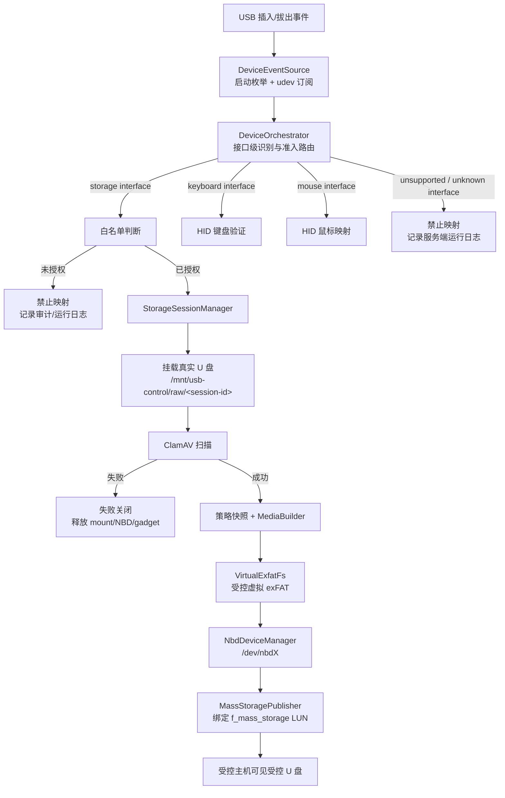

# 12 装置端 USB 控制架构与模块职责

本文档描述装置端 USB 管控链路的架构流程、模块边界和关键交互关系。本文面向服务端研发、测试和架构维护，作为 `03-模块划分.md`、`05-数据流设计.md`、`06-状态机设计.md` 的装置端运行架构补充。

## 1. 架构目标

装置端 USB 管控链路的核心目标是：仅允许白名单大容量存储设备、通过验证的键盘和鼠标映射到受控主机；其它 USB 接口不映射。大容量存储设备经过白名单、挂载、扫描、策略快照、受控虚拟介质、NBD、USB Gadget 的完整链路后，对受控主机可见。

架构遵循以下原则：

- 设备准入按 USB 接口最小单位处理，不按整台复合设备整体放行。
- `DeviceOrchestrator` 负责 USB 识别、准入判断、运行态登记和路由，不承担挂载、扫描、虚拟介质、NBD 或 Gadget 细节。
- `StorageSessionManager` 统一拥有大容量存储设备的会话生命周期，包含挂载、扫描、策略快照、受控虚拟介质构建、NBD 发布、Gadget 绑定、失败回滚、拔出清理、停服务清理和启动恢复。
- `file-access` 内部按清晰边界拆分虚拟 exFAT、写事务解析、真实文件系统提交、metadata 状态、NBD 协议和 Gadget 发布，NBD 不承载文件策略或 exFAT 业务语义。
- 服务端运行日志用于问题排查；管理端可查询的业务状态、审计日志和恶意代码检测日志分别由独立模块维护，不与 tracing 运行日志混用。

## 2. 总体链路



## 3. 设备事件源

设备事件源由 `usb-identify` 内部拥有，负责把 Linux 系统 USB 状态转换为装置端内部 `DeviceEvent`。它不依赖外部 udev rule，也不修改系统 udev 服务。

职责：

- 服务启动时枚举已经存在的 USB interface，避免服务重启后漏掉已插入设备。
- 运行期通过 udev monitor 订阅 USB interface add/remove 事件。
- 将符合处理条件的 USB interface 事件转换为内部事件并发送给 `DeviceOrchestrator`。
- 服务停止时停止订阅任务，释放 udev monitor fd，不影响系统 `systemd-udevd`。

不负责：

- 不判断白名单。
- 不挂载存储设备。
- 不启动 NBD、Gadget 或 HID 映射。
- 不写业务审计日志。

复合设备处理规则：

- 复合设备插入时可能产生多个 interface 事件，每个 interface 独立识别、独立路由。
- 手机等复合设备如果包含 `08` 大容量存储接口，该接口在白名单通过后可进入存储链路；同一物理设备上的其它不支持接口不映射，仅记录服务端运行日志。
- 拔出时按已建立的 interface/session 关系清理对应资源；没有进入业务链路的 interface 仅执行运行态清理。

## 4. DeviceOrchestrator

`DeviceOrchestrator` 是 USB 准入与路由层。它接收 `DeviceEventSource` 的事件，基于 USB 描述符、接口类、接口子类、协议号、端点能力识别接口类型，并把合法接口转交给对应业务模块。

职责：

- 维护 USB parent/interface 的临时关联，支持复合设备按接口最小单位处理。
- 识别三类支持接口：大容量存储、键盘、鼠标。
- 对未知接口、不支持接口、描述符与能力不一致的接口执行默认拒绝。
- 对 storage interface 执行白名单准入判断，并在通过后调用 `StorageSessionManager`。
- 对 keyboard interface 创建运行态并调用 HID 键盘验证链路。
- 对 mouse interface 创建运行态并调用 HID 鼠标映射链路。
- 对白名单 storage、键盘、鼠标维护 `DeviceRuntimeRegistry` 运行态。
- 按 PRD 规则写入 U 盘、键盘、鼠标相关业务审计日志；不支持和未知接口仅记录服务端 tracing 运行日志。

不负责：

- 不执行真实文件系统挂载。
- 不调用 ClamAV。
- 不构建虚拟 exFAT。
- 不直接操作 `/dev/nbdX`。
- 不直接绑定或解绑 f_mass_storage LUN。
- 不实现管理端协议接口。

策略生效边界：

- USB 准入决策在设备插入并进入链路时形成。
- 白名单和准入相关策略更新不对已映射设备热更新；下一次插拔重新进入准入流程时生效。

## 5. 键盘与鼠标链路

键盘和鼠标由 `hid-access` 负责，输入来自 `DeviceOrchestrator`，不自行监听 udev。

键盘职责：

- 接管键盘 HID 输入。
- 验证用户是否按顺序输入 `1`、`2`、`3`、`4`。
- 验证过程不向受控主机透传按键。
- 输入错误时判定本次验证失败，设备重新插拔后进入新的验证流程，并记录运行日志。
- 验证通过后映射键盘到受控主机，并更新运行态。
- 拔出时释放输入缓冲、运行态和 HID 资源。

鼠标职责：

- 鼠标识别通过后自动映射到受控主机。
- 映射成功、失败、拔出均更新运行态并记录运行日志。

不负责：

- 不判断 U 盘白名单。
- 不参与文件访问策略。
- 不处理病毒扫描或 NBD。

## 6. StorageSessionManager

`StorageSessionManager` 是大容量存储设备的唯一生命周期所有者。`DeviceOrchestrator` 将已通过白名单准入的 storage 设备交给它，存储链路由它统一编排。

职责：

- 为每个已授权 storage 设备创建唯一 storage session。
- 挂载真实 U 盘分区到 `/mnt/usb-control/raw/<session-id>`。
- 调用 malware-scan 执行 ClamAV 扫描。
- 获取文件访问策略和白名单权限快照。
- 调用 `MediaBuilder` 构建受控虚拟 exFAT。
- 调用发布层将虚拟 exFAT 通过 NBD 暴露为 `/dev/nbdX`。
- 将 `/dev/nbdX` 绑定到 f_mass_storage LUN。
- 更新 `DeviceRuntimeRegistry` 中 storage 设备的 accepted、scanning、mapped、failed、removed 等运行态。
- 任一阶段失败时执行失败关闭，释放已经分配的 mount、NBD、Gadget 资源，并保留可查询失败状态。
- 拔出时统一清理 storage session。
- 服务停止时统一清理 active session。
- 服务启动时执行装置端资源恢复，清理 stale NBD、Gadget LUN 和 raw mount。

不负责：

- 不解析 USB 描述符。
- 不维护白名单数据。
- 不实现 ClamAV 扫描细节。
- 不解析 exFAT 扇区写事务。
- 不实现管理端协议编码。

资源命名规则：

- 装置端使用独立 raw mount 根目录 `/mnt/usb-control/raw`，避免与其它程序使用 `/mnt/usb_raw` 等通用目录发生冲突。
- raw mount 使用短 session id 作为目录名，不使用完整 sysfs path 作为目录名。
- session id 用于装置端资源隔离、清理和日志定位，不作为安全凭证。

## 7. Malware Scan

恶意代码扫描模块负责调用 ClamAV 并输出稳定扫描结果。它不拥有 storage session 生命周期。

职责：

- 对已挂载 raw 目录执行全盘扫描。
- 输出 clean、infected、failed 等扫描结果。
- 对扫描服务不可用、扫描引擎失败、I/O 失败、扫描取消等失败进行稳定分类。
- 对病毒命中写入恶意代码检测日志。
- 把病毒文件路径列表提供给 `MediaBuilder`。

不负责：

- 不决定是否启动 NBD。
- 不绑定 Gadget。
- 不卸载 raw mount。
- 不写 storage runtime 状态。

扫描失败处理：

- 扫描失败时 storage session 执行失败关闭，不完成受控 U 盘映射。
- 失败分类应写入服务端运行日志，并更新 storage runtime failed 状态。

## 8. File Access 与虚拟 exFAT

`file-access` 是存储链路中受控介质的核心模块。它基于 raw mount 中的真实文件树，生成受控虚拟 exFAT 块设备后端。受控主机看到的是虚拟 exFAT，不直接访问真实 U 盘分区。

### 8.1 MediaBuilder

职责：

- 读取 raw mount 的完整递归目录树。
- 接收扫描命中的病毒文件列表。
- 接收文件访问策略和白名单读写权限快照。
- 构建 `VirtualExfatFs`。

不负责：

- 不监听 USB。
- 不挂载真实 U 盘。
- 不启动 NBD。
- 不写真实文件系统。

### 8.2 VirtualExfatFs

`VirtualExfatFs` 是 NBD 使用的块设备门面，仅暴露 `read_at`、`write_at`、`flush`、`shutdown` 等块设备语义。

职责：

- 向 NBD 层提供统一 `BlockBackend`。
- 将 READ/WRITE/FLUSH 请求委托给内部 runtime。
- 对外不暴露低层事务提交接口，避免业务绕过统一写路径。

不负责：

- 不持有 USB session 生命周期。
- 不绑定 Gadget。
- 不直接调用 ClamAV。
- 不处理管理端协议。

### 8.3 ExfatRuntimeState

`ExfatRuntimeState` 是虚拟 exFAT 的运行态协调者。

职责：

- 持有 VFS index、metadata state、策略快照、pending transaction。
- 协调 READ 路径：metadata 读取、文件数据读取、策略阻断读取、占位内容读取。
- 协调 WRITE 路径：sector owner 识别、事务收集、事务解析、提交管线。
- 在 flush、shutdown、unmap 场景中处理未完成事务，避免未提交 metadata 提前暴露。

不负责：

- 不执行真实文件系统提交细节。
- 不解析 USB 设备。
- 不管理 NBD fd。

### 8.4 WriteInterpreter 与 TransactionResolver

职责：

- `WriteInterpreter` 按 sector owner 将 Windows 写入分为 FAT、allocation bitmap、目录项、文件数据等 transaction write。
- `TransactionResolver` 判断一次写事务是否闭合，并输出可提交 mutation。
- resolver 返回 `Complete`、`Incomplete`、`Invalid` 等明确状态。

不负责：

- 不执行策略判断。
- 不写真实 U 盘。
- 不更新已提交 metadata overlay。

### 8.5 CommitPipeline

职责：

- 对 resolver 输出的 mutation 执行文件访问策略检查。
- 调用真实文件系统提交组件写入 `/mnt/usb-control/raw/<session-id>`。
- 真实文件系统提交成功后，统一更新 VFS、FAT、allocation bitmap、directory store、sector owner map 和 metadata overlay。
- 真实提交失败或状态更新失败时执行失败关闭，禁止虚拟视图宣称一个未完成的变更已经成功。

不负责：

- 不解释 NBD 协议。
- 不监听 USB。
- 不直接绑定 Gadget。

### 8.6 Metadata State / Renderer / Overlay

职责：

- `ExfatMetadataState` 统一管理 FAT、allocation bitmap、directory store、sector owner map 等 metadata 事实状态。
- `MetadataRenderer` 基于已提交状态渲染 exFAT metadata 扇区。
- `MetadataOverlay` 仅暴露已提交的 metadata 变更，未闭合或未提交事务不进入虚拟读路径。

不负责：

- 不执行真实文件系统写入。
- 不决定 USB 准入。
- 不判断管理端权限。

### 8.7 策略命中文件的受控表达

受控虚拟 exFAT 需要保证策略命中文件不泄露真实内容。

- 病毒文件、可执行控制命中文件、黑名单类型文件、自动读取控制命中文件均不向受控主机暴露原始内容。
- 被禁止访问的文件统一使用占位内容表达，占位文本为：

```text
该文件已被 USB 安全策略禁止访问。
如需使用该文件，请联系管理员确认策略配置。
```

- 被禁止访问文件不向受控主机暴露原始内容；读取命中时应返回策略阻断结果，不能返回真实文件数据。
- 如果通过占位内容使受控主机弹出应用层错误提示，复制结果不包含原始内容。

## 9. NBD 层

NBD 层的职责是 Linux NBD 协议适配和设备生命周期管理。它不理解文件、策略、扫描或 exFAT 业务。

职责：

- 选择并启动 `/dev/nbdX`。
- 通过 socketpair + ioctl 完成 `NBD_SET_SOCK`、`NBD_SET_SIZE`、`NBD_DO_IT` 等内核交互。
- 启动 request loop，把 NBD READ/WRITE/FLUSH/DISCONNECT 转换为 `BlockBackend` 调用。
- 停止时按顺序执行 disconnect、clear sock、clear queue、join request loop、释放 fd。
- 启动恢复时清理装置端占用或 stale 的 NBD 设备。
- 生产环境设置 `nbd.max_part=0`，禁止内核对 `/dev/nbdX` 做分区扫描，避免 `nbdXpN` udev 风暴。

不负责：

- 不解析 exFAT。
- 不判断文件策略。
- 不调用 ClamAV。
- 不写 raw mount。
- 不选择 storage 是否可映射。

## 10. Gadget 发布层

Gadget 发布层负责把 storage session 生成的 `/dev/nbdX` 绑定给受控主机。

职责：

- 将 f_mass_storage LUN 的 backing file 指向 `/dev/nbdX`。
- 绑定整盘 NBD 设备，不绑定 `/dev/nbdXp1`。
- 按 storage session 生命周期解绑 LUN。
- 与 NBD 生命周期配合，保证停止顺序可恢复。

不负责：

- 不构建虚拟 exFAT。
- 不判断文件访问策略。
- 不处理 USB host 侧真实 U 盘枚举。

## 11. DeviceRuntimeRegistry 与管理端协议

`DeviceRuntimeRegistry` 保存白名单 storage、键盘、鼠标进入受控链路后的运行态。它是管理端运行状态查询的数据源，不是服务端 tracing 日志，也不是业务审计日志。

运行态接口边界：

- `CMD_GET_CONNECTED_DEVICES`：返回可用于白名单添加的已连接 storage 候选，不表达 storage 是否已扫描、映射或失败。
- `CMD_GET_DEVICE_RUNTIME_STATUS`：返回已纳入受控链路的白名单 storage、键盘、鼠标运行态，用于管理端展示 accepted、scanning、mapped、failed、removed 等状态。
- 未加白名单 storage、不支持接口、未知接口、BadUSB 风险接口不进入 `DeviceRuntimeRegistry`，仅记录服务端 tracing 运行日志。

权限边界：

- 服务端 tracing 运行日志不按管理端三权权限建模，用于装置排查。
- 管理端协议接口的可调用权限由 protocol-gateway 和权限模型控制。
- USB 审计日志、恶意代码检测日志、操作日志按 PRD 和权限模型进入管理端日志查询链路。

## 12. 数据库与配置边界

装置端 SQLite 数据库由部署安装流程创建和初始化。运行时服务只打开并使用已有数据库，不在 USB 插入链路中隐式创建业务表结构。

职责边界：

- 白名单、文件策略、账号、授权、日志等持久化由对应服务通过 repository/DAO 访问。
- `StorageSessionManager` 获取策略快照，不直接管理策略配置页面语义。
- USB 准入和映射链路不直接修改数据库 schema。

## 13. 失败处理与恢复

装置端 USB 链路采用失败关闭原则：不能确认安全、不能完整构建受控视图或不能完成资源发布时，禁止映射到受控主机。

典型失败处理：

- 未授权 storage：不启动 storage session，不映射。
- 挂载失败：session failed，释放已分配资源。
- ClamAV 不可用或扫描失败：session failed，不映射。
- 虚拟 exFAT 构建失败：session failed，卸载 raw mount。
- NBD 启动失败：session failed，停止 NBD，卸载 raw mount。
- Gadget 绑定失败：session failed，解绑 LUN，停止 NBD，卸载 raw mount。
- exFAT 写事务不完整或无效：不提交真实 U 盘，不提前暴露 metadata。
- 真实文件系统提交失败：向受控主机返回错误，session 进入失败保护，避免虚拟视图和真实 U 盘不一致。

启动恢复：

- 清理装置端遗留的 raw mount。
- 清空或恢复 f_mass_storage LUN。
- 对 stale `/dev/nbdX` 执行 disconnect/clear。
- 不恢复上次未完成的映射会话；用户重新插拔后重新进入完整准入流程。

## 14. 模块边界汇总

| 模块 | 负责 | 不负责 |
| --- | --- | --- |
| DeviceEventSource | 启动枚举、udev 订阅、事件转换、停止监听 | 白名单、挂载、扫描、NBD、审计日志 |
| DeviceOrchestrator | 接口级识别、准入、路由、运行态登记 | mount、scan、virtual media、NBD、Gadget 细节 |
| hid-access | 键盘 `1234` 验证、鼠标映射、HID 资源释放 | storage 白名单、文件策略、NBD |
| StorageSessionManager | storage 会话生命周期、挂载、扫描编排、虚拟介质发布、失败回滚、清理恢复 | USB 描述符解析、exFAT 扇区解析、协议编码 |
| malware-scan | ClamAV 调用、扫描结果分类、病毒列表、恶意代码检测日志 | session 清理、NBD、Gadget |
| MediaBuilder | raw 文件树 + 策略快照 + 病毒列表到 VirtualExfatFs | USB 监听、NBD 生命周期 |
| VirtualExfatFs | BlockBackend 门面、读写入口 | 设备准入、Gadget、管理端协议 |
| ExfatRuntimeState | 虚拟 exFAT 读写状态协调、pending transaction | 真实提交细节、USB 生命周期 |
| WriteInterpreter / TransactionResolver | 扇区写入分类、事务闭合判断、mutation 输出 | 策略判断、真实文件系统提交 |
| CommitPipeline | 策略检查、真实提交、metadata/VFS 同步更新 | NBD 协议、USB 事件 |
| NbdDeviceManager / NbdDevice | `/dev/nbdX` 生命周期、NBD ioctl、request loop | 文件、策略、exFAT 业务 |
| MassStoragePublisher | f_mass_storage LUN 绑定与解绑 | 虚拟文件系统构建、策略判断 |
| DeviceRuntimeRegistry | 已纳入受控链路设备的运行态查询 | tracing 运行日志、审计日志、白名单候选列表 |
| protocol-gateway | 管理端协议入口、权限校验、命令路由 | USB 事件监听、NBD/exFAT 内部状态实现 |

## 15. 与 PRD 的业务对应关系

- 普通 U 盘：先识别为大容量存储接口，再通过白名单，扫描后映射。
- 未授权 U 盘：禁止映射。
- 病毒 U 盘：允许映射非命中文件；命中文件在受控视图中不可访问且不泄露真实内容。
- 键盘：通过 `1234` 验证，验证过程不透传，失败后重新插拔。
- 鼠标：识别后自动映射。
- 复合设备：按接口最小单位处理，映射支持且准入通过的接口。
- 未知/不支持接口：禁止映射，仅写服务端运行日志。
- 白名单和准入策略：插拔生效，不依赖对已映射设备热更新。
- 受控主机：访问装置端生成的受控虚拟 exFAT，不直接访问真实 U 盘分区。
