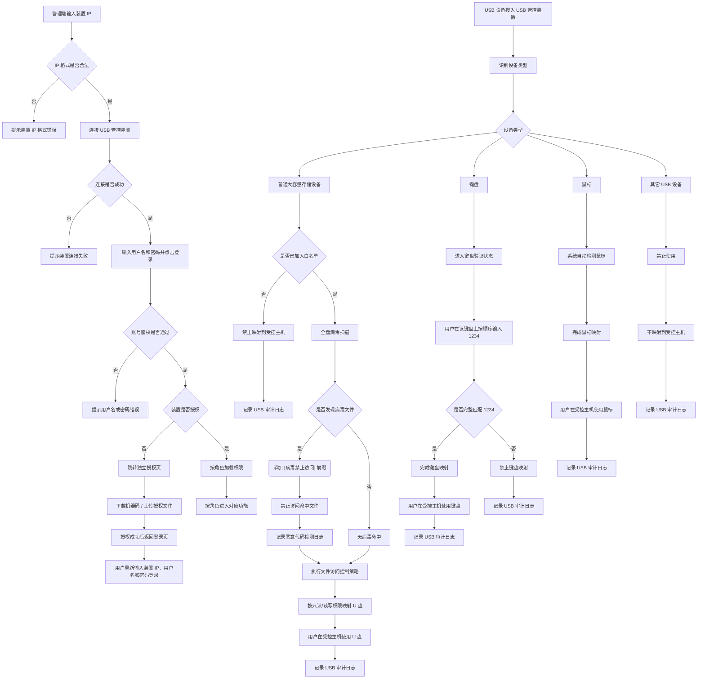

# USB 安全管理系统产品需求文档 v1.0.1

## 1. 产品概述

### 1.1 产品定位

USB 安全管理系统是一款面向单台受控主机的 USB 外设安全管控产品。通过硬件装置接管 USB 接口，在 USB 外设与受控主机之间提供接入管控、介质映射、病毒检测、文件访问控制、日志审计、授权管理和系统维护能力，降低普通 U 盘、键盘、鼠标等外设接入带来的安全风险。

本版本覆盖直连部署场景下大容量存储设备、键盘、鼠标的基础管控能力。已纳入范围的功能需形成完整的配置、使用、日志、授权、升级和异常处理闭环。

### 1.2 产品架构

系统整体采用 C/S 架构，由 USB 管控装置服务端和管理控制程序客户端组成。管理端与装置端采用一对一网络直连模式，管理端同一时间仅连接并管理一台 USB 管控装置。

```
┌──────────────────────────────────────────────────────────┐
│                     USB 管控装置                          │
│                                                          │
│  USB 3.0 ──── U 盘接入口                                  │
│  USB 2.0 ──── 键盘 / 鼠标接入口                            │
│  OTG 直连口 ── 通过 USB 线连接受控主机                       │
│  网口 ──────── 通过网线连接管理主机                          │
│  电源口 ────── 供电                                        │
│                                                          │
│  内置：设备识别、病毒扫描引擎、文件访问控制、映射服务             │
└──────────────────────────────────────────────────────────┘
         │ OTG USB 直连                │ 网口（同一网络）
         ▼                            ▼
┌──────────────────┐          ┌─────────────────────┐
│    受控主机       │          │    管理主机           │
│  Windows / Linux │          │  Windows            │
│  使用映射后的      │          │  运行管理控制程序      │
│  U 盘、键盘、鼠标  │          │  配置、审计、维护      │
└──────────────────┘          └─────────────────────┘
```

**连接关系：**

- USB 管控装置与受控主机通过 OTG USB 线直连，用于 U 盘、键盘、鼠标的映射。
- USB 管控装置与管理主机通过网口连接，用于管理控制程序与装置通信。
- USB 管控装置出厂默认管理 IP 为 `19.19.19.16`。
- 管理主机需配置与 `19.19.19.16` 可通信的同网段 IP。
- 管理控制程序登录时需输入装置 IP、用户名和密码，装置 IP 必填并进行 IP 地址格式校验。
- USB 管控装置相当于服务端，管理控制程序相当于客户端。装置配置完成后，管理端可断开连接，USB 管控装置继续按当前真实配置独立执行管控。
- 白名单、U 盘权限、文件访问控制策略等管控配置以 USB 管控装置侧真实配置为准；管理端连接装置后实时读取展示，并在有权限操作时直接写回装置。
- 用户、角色、密码、登录会话、登录失败锁定、菜单权限、USB 审计日志、恶意代码检测日志、操作日志、授权状态、系统版本、病毒库版本等数据均以 USB 管控装置侧为准，管理端连接装置后读取并展示。
- 管理端不持久化任何业务数据、账号数据、日志数据、最近连接 IP、页面快照或查询结果；管理端仅在进程内存中保存当前连接、当前会话、当前页面状态和当前请求结果。
- 管理端关闭、崩溃或重启后，所有进程内存状态清空；再次使用需重新输入装置 IP、用户名和密码。
- 用户无需登录管理端即可使用授权、已认证和已允许映射的 USB 设备。
- 管理人员通过管理控制程序完成白名单配置、策略管理、日志审计、授权管理、系统升级、病毒库升级、自定义设备描述和用户管理等操作。

**硬件基础信息：**

- CPU：RK3568（ARM 架构）
- 内存：4GB
- 存储：32GB
- 操作系统：Ubuntu 22.04 或实际安装环境

**受控主机：** 支持 Windows、Linux 系统。

**管理端：** 适配主流 Windows 版本，包括 Windows 10 / Windows 11 专业版、家庭版。

### 1.3 本版本支持范围

- 管理端通过装置 IP 与单台 USB 管控装置一对一连接
- 授权信息管理和授权前登录限制
- 普通大容量存储设备识别与准入控制
- 键盘识别、`1234` 完整验证与映射
- 鼠标识别与映射
- 普通 U 盘白名单管理
- 普通 U 盘只读 / 读写权限控制
- 恶意代码检测与病毒文件访问阻断
- 病毒库升级
- 文件访问控制
- 策略导入导出
- 日志审计
- 系统程序升级
- 自定义设备描述
- 用户 / 角色权限管理

### 1.4 本版本不支持范围

- 安全 U 盘相关专属能力，包括芯片识别、默认可信、自动导入策略和自动升级
- 安全 U 盘自由使用开关
- 安全 U 盘自动导入策略
- 安全 U 盘自动升级系统程序或病毒库
- 指示灯状态联动

### 1.5 U 盘术语说明


| 术语                | 定义                                          |
| ----------------- | ------------------------------------------- |
| 安全 U 盘            | 安全专用 U 盘，内置硬件加密芯片（本版本不支持特殊识别和专属能力）          |
| 普通 U 盘            | 日常使用的普通 U 盘                                 |
| 已认证 U 盘 / 白名单 U 盘 | 已加入白名单的普通 U 盘                               |
| 介质映射              | USB 设备通过 USB 管控装置映射到受控主机的过程                 |
| 装置端添加             | 普通 U 盘插入 USB 管控装置后，由管理控制程序读取装置侧检测到的设备并添加白名单 |
| 管理端添加             | 普通 U 盘插入运行管理控制程序的管理主机后，由管理控制程序读取本机设备并添加白名单  |


## 2. 用户角色与权限

系统采用三权分立模式，包含系统管理员、操作员、审计员三类角色。不同角色仅可访问和操作其权限范围内的功能，权限控制需同时作用于菜单、按钮和接口。

### 2.1 角色与默认账号


| 角色    | 默认账号       | 默认密码           | 权限范围                               |
| ----- | ---------- | -------------- | ---------------------------------- |
| 系统管理员 | `admin`    | `admin@123`    | 系统管理、用户管理、授权管理、升级维护                |
| 操作员   | `operator` | `operator@123` | U 盘设备控制、文件访问控制、策略导入导出              |
| 审计员   | `audit`    | `audit@123`    | USB 审计日志、恶意代码检测日志、操作日志的查看、查询、导出、清理 |


### 2.2 页面访问权限

页面访问权限用于定义三类角色登录后可见和可进入的页面。装置连接、授权校验和账号登录属于登录前公共流程，不纳入角色权限矩阵。无权限页面不得在菜单中展示；通过地址、路由或接口直接访问时，系统应拒绝。


| 页面      | 系统管理员 | 操作员 | 审计员 |
| ------- | ----- | --- | --- |
| 修改本人密码  | 支持    | 支持  | 支持  |
| 用户管理    | 支持    | 不支持 | 不支持 |
| 系统管理    | 支持    | 不支持 | 不支持 |
| U 盘设备控制 | 不支持   | 支持  | 不支持 |
| 文件访问控制  | 不支持   | 支持  | 不支持 |
| 策略管理    | 不支持   | 支持  | 不支持 |
| 日志管理    | 不支持   | 不支持 | 支持  |


各角色登录成功后默认显示的页面：


| 角色    | 默认页面   |
| ----- | ------ |
| 系统管理员 | 用户管理   |
| 操作员   | 文件访问控制 |
| 审计员   | 日志管理   |


### 2.3 页面操作权限

页面操作权限用于定义三类角色登录后可执行的按钮、表单提交和接口操作。无权限操作不得展示操作入口；如通过接口直接发起，系统应拒绝。


| 页面      | 操作                | 系统管理员 | 操作员 | 审计员 |
| ------- | ----------------- | ----- | --- | --- |
| 修改本人密码  | 修改本人密码            | 支持    | 支持  | 支持  |
| 用户管理    | 新建用户              | 支持    | 不支持 | 不支持 |
| 用户管理    | 删除非内置用户           | 支持    | 不支持 | 不支持 |
| 用户管理    | 重置用户密码            | 支持    | 不支持 | 不支持 |
| 系统管理    | 查看授权状态            | 支持    | 不支持 | 不支持 |
| 系统管理    | 下载机器码             | 支持    | 不支持 | 不支持 |
| 系统管理    | 上传授权文件            | 支持    | 不支持 | 不支持 |
| 系统管理    | 查看系统版本            | 支持    | 不支持 | 不支持 |
| 系统管理    | 上传系统升级包           | 支持    | 不支持 | 不支持 |
| 系统管理    | 查看病毒库版本和更新时间      | 支持    | 不支持 | 不支持 |
| 系统管理    | 上传病毒库升级包          | 支持    | 不支持 | 不支持 |
| 系统管理    | 查看设备描述            | 支持    | 不支持 | 不支持 |
| 系统管理    | 修改设备描述            | 支持    | 不支持 | 不支持 |
| U 盘设备控制 | 查看白名单             | 不支持   | 支持  | 不支持 |
| U 盘设备控制 | 装置端添加白名单          | 不支持   | 支持  | 不支持 |
| U 盘设备控制 | 管理端添加白名单          | 不支持   | 支持  | 不支持 |
| U 盘设备控制 | 删除白名单             | 不支持   | 支持  | 不支持 |
| U 盘设备控制 | 修改白名单描述           | 不支持   | 支持  | 不支持 |
| U 盘设备控制 | 设置只读 / 读写权限       | 不支持   | 支持  | 不支持 |
| 文件访问控制  | 启用 / 禁用可执行程序访问控制  | 不支持   | 支持  | 不支持 |
| 文件访问控制  | 启用 / 禁用介质自动读取功能控制 | 不支持   | 支持  | 不支持 |
| 文件访问控制  | 启用 / 禁用文件类型访问控制   | 不支持   | 支持  | 不支持 |
| 文件访问控制  | 添加文件类型黑名单         | 不支持   | 支持  | 不支持 |
| 文件访问控制  | 删除文件类型黑名单         | 不支持   | 支持  | 不支持 |
| 策略管理    | 导入策略              | 不支持   | 支持  | 不支持 |
| 策略管理    | 导出策略              | 不支持   | 支持  | 不支持 |
| 日志管理    | 查看 / 查询 USB 审计日志  | 不支持   | 不支持 | 支持  |
| 日志管理    | 查看 / 查询恶意代码检测日志   | 不支持   | 不支持 | 支持  |
| 日志管理    | 查看 / 查询操作日志       | 不支持   | 不支持 | 支持  |
| 日志管理    | 导出日志              | 不支持   | 不支持 | 支持  |
| 日志管理    | 清理日志              | 不支持   | 不支持 | 支持  |


### 2.4 权限规则

- 内置用户不可删除。
- 用户可修改本人密码。
- 系统管理员可新建用户、删除非内置用户、重置用户密码。
- 系统管理员不支持修改 U 盘白名单、U 盘权限、文件访问控制和策略导入导出。
- 操作员不支持用户管理、系统管理和日志审计。
- 审计员不支持用户管理、系统管理、安全策略配置和设备映射配置。
- 管理端可根据装置侧返回的当前用户角色控制菜单和按钮展示。
- 装置端必须对所有接口执行权限校验；无权限访问菜单、按钮或接口时，系统应拒绝操作并提示无权限。
- 用户管理、密码重置、登录失败锁定、授权、升级、白名单、策略和日志清理等管理操作需由装置侧记录操作日志。

### 2.5 连接、授权与登录管理

- 管理控制程序登录页需包含装置 IP、用户名、密码和登录按钮。
- 装置 IP 输入框为空，不预填、不记住、不展示默认 IP；装置 IP 必填，并进行 IP 地址格式校验。
- 用户点击登录后，系统连接当前装置，并由装置侧先校验用户名和密码。
- 装置 IP 为空、装置 IP 格式错误、装置连接失败时，仅在管理端界面提示，不记录操作日志。
- 未授权装置不得进入主系统。
- 账号鉴权通过后，装置侧校验授权状态。
- 装置未授权时，任一有效账号鉴权通过后均跳转到独立授权页，授权页提供“下载机器码”和“上传授权文件”两个入口。
- 独立授权页属于进入主系统前的装置激活流程，不按登录后三权权限限制；系统管理员、操作员、审计员账号鉴权通过后均可在该页导入授权文件。
- 授权成功后自动返回登录页，用户需再次输入装置 IP、用户名和密码完成登录；进入主系统后的“系统管理-授权信息管理”仍仅系统管理员可访问和操作。
- 授权页中的“下载机器码”为弹窗交互，需展示可复制机器码文本、二维码及二维码下载按钮。
- 授权页中的“上传授权文件”为弹窗交互，支持选择 `txt` 授权文件后确定上传。
- 登录成功后，装置侧创建登录会话，管理端仅在当前进程内存中保存会话标识。
- 管理端关闭、崩溃或重启后，会话标识丢失，再次使用需重新输入装置 IP、用户名和密码。
- 用户连续 5 次登录失败后，装置侧锁定账号 5 分钟。
- 锁定期间输入正确或错误密码均提示锁定状态，并由装置侧记录登录失败日志。
- 登录成功后，该账号登录失败计数清零；锁定 5 分钟自动解除后，失败计数清零。
- 管理端 5 分钟无操作自动登出，并使当前内存会话失效；装置侧会话按装置端会话规则失效。
- 密码复杂度要求：长度不少于 8 位，需包含英文字母、数字、特殊字符中的至少两类。

### 2.6 验收标准

- 系统内置系统管理员、操作员、审计员三类角色。
- 默认账号和默认密码符合本章定义。
- 登录前需输入装置 IP，装置 IP 为空或格式错误时禁止登录。
- 登录页始终展示装置 IP、用户名、密码和登录按钮，装置 IP 输入框为空且不预填默认 IP。
- 未授权装置使用任一有效账号鉴权通过后均跳转独立授权页，授权成功后自动返回登录页；再次登录后按角色进入主系统。
- 三类角色登录后只能看到其有权限访问的页面。
- 三类角色只能执行其权限范围内的页面操作。
- 系统管理员不能修改安全策略。
- 操作员不能访问系统管理和日志审计页面。
- 审计员不能修改系统配置和安全策略。
- 连续 5 次登录失败后，账号锁定 5 分钟。
- 管理端 5 分钟无操作自动登出。
- 用户相关关键操作由装置侧记录操作日志。

## 3. 核心业务流程

本版本核心流程围绕装置连接、授权登录、移动存储介质、键盘、鼠标的映射使用展开。管理端通过装置 IP 与单台 USB 管控装置建立一对一连接；用户账号鉴权通过且装置授权有效后，按角色进入管理控制程序。普通 U 盘需加入白名单后，重新插入装置并完成病毒扫描和文件访问控制处理，再映射至受控主机；键盘需完整输入 `1234` 验证后映射；鼠标插入后自动映射；不支持的 USB 设备类型默认禁止。




### 3.1 管理端连接与登录流程

- 管理端启动后，用户输入装置 IP。
- 系统校验装置 IP 格式，格式错误时禁止发起连接。
- 用户输入用户名和密码并点击登录后，管理端连接到当前 IP 对应的 USB 管控装置，由装置侧先校验用户名和密码。
- 账号鉴权通过后，装置侧检查授权状态。
- 装置未授权时，任一有效账号鉴权通过后均跳转独立授权页。
- 独立授权页不区分用户角色，系统管理员、操作员、审计员账号鉴权通过后均可下载机器码和上传授权文件。
- 用户可在授权页点击“下载机器码”，弹窗查看可复制机器码文本、二维码，并支持下载二维码。
- 用户可在授权页点击“上传授权文件”，弹窗选择 `txt` 授权文件并确定上传。
- 未选择授权文件直接点击上传时，系统提示：`请先选择授权文件`。
- 授权成功后，系统自动返回登录页；授权失败时，提示授权失败原因并停留在授权流程。
- 装置已授权时，系统按角色加载功能菜单和权限。
- 管理端同一时间仅允许连接一台装置；切换装置需断开当前连接后重新输入装置 IP。

### 3.2 普通 U 盘使用流程

- 普通 U 盘插入 USB 管控装置后，系统识别为普通大容量存储设备。
- 系统判断该 U 盘是否已加入白名单。
- 未加入白名单的普通 U 盘禁止映射，并记录 USB 审计日志。
- 操作员可选择装置端添加或管理端添加，将普通 U 盘加入白名单。
- 操作员添加白名单时，可填写或修改设备描述，并设置 U 盘使用权限，权限包括只读 / 读写。
- 添加完成后系统提示重新拔插 U 盘，重新插入后策略生效。
- 已加入白名单的普通 U 盘重新插入后进入全盘病毒扫描流程。
- 如扫描发现病毒文件，系统对命中文件添加 `[病毒禁止访问]` 前缀，并禁止受控主机侧对命中文件执行任何文件操作，同时记录恶意代码检测日志。
- 如扫描未发现病毒文件，继续后续处理。
- 系统继续执行文件访问控制策略，包括可执行程序访问控制、介质自动读取功能控制和文件类型访问控制。
- 系统按白名单中配置的只读 / 读写权限映射 U 盘。
- 用户在受控主机上使用 U 盘。

### 3.3 键盘使用流程

- 键盘插入 USB 管控装置后，系统识别设备类型。
- 键盘进入验证状态，用户需在该键盘上按顺序输入 `1234` 完成验证。
- 本版本固定密钥为 `1234`，不提供密钥配置入口。
- 验证规则为严格完整匹配，输入序列必须与固定验证码完全一致；任何多余输入、缺失输入、顺序错误或非验证码按键均视为验证失败。
- 验证通过后，系统完成键盘映射，可实现普通按键、快捷键、组合键等常用键盘输入能力。
- 验证失败或未验证时，键盘不得映射到受控主机。
- 验证过程中键盘输入不得传递到受控主机。
- 键盘验证和映射结果需记录 USB 审计日志。
- 本版本不提供指示灯状态提示。

### 3.4 鼠标使用流程

- 鼠标插入 USB 管控装置后，系统识别设备类型。
- 鼠标无需额外验证，系统自动检测并完成鼠标映射。
- 映射成功后，可实现左右键、滚轮、双击、连击等鼠标常用操作。
- 鼠标映射成功或失败需记录 USB 审计日志。

### 3.5 管理端与装置断开连接流程

- 管理端与装置断开连接后，不强制退出当前登录账号。
- 系统进入“装置断开连接”状态，并在页面顶部提示：`USB 管控装置已断开连接，请检查网络或设备连接。`
- 已认证并已映射的设备继续由装置按当前真实配置独立处理，不依赖管理端在线状态。
- 断开连接期间，管理端保留当前页面和当前页面进程内存状态，但不得落盘保存。
- 断开连接期间，页面保留查询、筛选、导出、清理、上传、保存、用户管理、修改密码等入口；用户点击后请求失败并提示：`USB 管控装置已断开连接，操作失败。`
- 重新连接后，管理端需向装置侧校验当前内存会话；会话有效时停留当前页面并刷新数据，会话失效时返回登录页重新登录。
- 重新连接装置成功后，管理端需从装置侧重新读取当前页面及全局状态相关的真实数据，并刷新页面展示。
- 本版本不支持策略暂存、恢复连接后同步或单独下发动作。

### 3.6 验收标准

- 管理端通过装置 IP 与单台装置一对一连接。
- 未授权装置不得进入主系统，需先完成授权并返回登录页后再次登录。
- 普通 U 盘主流程覆盖白名单判断、白名单添加方式选择、重新拔插生效、病毒扫描、文件访问控制、权限映射和日志记录。
- 未认证普通 U 盘不得映射到受控主机。
- 键盘必须完整输入 `1234` 验证通过后才能映射。
- 鼠标插入后可自动映射。
- 非支持类型 USB 接口和未知 USB 设备默认禁止。
- 设备接入、映射成功、映射失败和禁止事件均需记录 USB 审计日志。
- 管理端流程需符合三权分立权限边界。
- 管理端与装置断开连接后，装置继续按当前真实配置运行。
- 重新连接装置后，管理端校验会话；会话有效时重新读取装置真实配置并刷新页面，会话失效时返回登录页。

## 4. 设备识别与准入

本模块用于定义 USB 管控装置对不同 USB 设备类型的识别和准入处理规则。设备或设备接口只有符合本版本支持范围并满足准入条件后，才允许映射到受控主机。


| 设备 / 接口类型      | 本版本处理方式                     |
| -------------- | --------------------------- |
| 普通大容量存储设备      | 进入白名单、病毒扫描、文件访问控制和权限映射流程    |
| 未认证普通 U 盘      | 禁止映射到受控主机                   |
| 已加入白名单的普通 U 盘  | 重新插入后扫描，并按策略映射              |
| 键盘             | 在该键盘上按顺序输入 `1234`，完整验证通过后映射 |
| 鼠标             | 系统自动检测并完成映射                 |
| 未知 USB 设备或未知接口 | 默认禁止                        |
| 安全 U 盘         | 本版本不支持芯片识别、默认可信等专属能力        |


### 4.1 普通大容量存储设备准入

- 普通大容量存储设备需加入白名单后才能使用。
- 未加入白名单的普通 U 盘不得映射到受控主机。
- 已加入白名单的普通 U 盘重新插入后，进入病毒扫描、文件访问控制和权限映射流程。
- 未加入白名单的普通 U 盘禁止映射、白名单 U 盘映射成功、映射失败等事件均记录 USB 审计日志。
- 普通 U 盘白名单、权限和添加方式在“U 盘设备控制与白名单管理”章节中定义。

### 4.2 键盘准入与映射

- 键盘插入后必须在该键盘上按顺序输入 `1234` 完成验证。
- 本版本固定密钥为 `1234`，不提供密钥配置入口。
- 验证规则为严格完整匹配，输入序列必须等于固定验证码 `1234`；任何多余输入、缺失输入、顺序错误或非验证码按键均视为验证失败。
- 验证通过后完成键盘映射，可实现普通按键、快捷键、组合键等常用键盘输入能力。
- 验证失败或未验证时不得映射。
- 验证过程中键盘输入不得传递到受控主机。
- 键盘验证成功、验证失败、映射成功、映射失败等事件均记录 USB 审计日志。
- 本版本不提供指示灯状态提示。
- 设备识别和映射逻辑不得将非键盘能力错误放行。

### 4.3 鼠标准入与映射

- 鼠标插入后，系统自动检测并完成映射。
- 映射成功和映射失败均记录 USB 审计日志。

### 4.4 安全 U 盘处理

- 本版本不实现安全 U 盘芯片识别。
- 本版本不实现安全 U 盘默认可信和自由使用。
- 本版本不实现安全 U 盘自动导入策略、自动升级系统程序或病毒库。
- 如果安全 U 盘以普通大容量存储设备形态被识别，本版本按普通 U 盘流程处理。
- 安全 U 盘专属能力不进入本版本范围。

### 4.5 验收标准

- 系统能区分普通大容量存储设备、键盘、鼠标和未知设备。
- 未加入白名单的普通 U 盘不能映射。
- 已加入白名单的普通 U 盘进入病毒扫描和策略处理流程。
- 键盘必须完整输入 `1234` 验证通过后才能映射。
- 鼠标插入后自动映射。
- 安全 U 盘专属能力不进入本版本。
- 禁止、映射成功、映射失败均需记录 USB 审计日志。

## 5. U 盘设备控制与白名单管理

U 盘设备控制与白名单管理由操作员使用，用于将普通移动存储设备添加为受信任设备，并设置只读 / 读写权限。只有加入白名单的普通 U 盘才允许进入病毒扫描、文件访问控制和映射流程。

### 5.1 使用角色


| 角色    | 使用范围                             |
| ----- | -------------------------------- |
| 操作员   | 查看、新增、修改、删除普通 U 盘白名单，设置只读 / 读写权限 |
| 系统管理员 | 不支持配置 U 盘白名单                     |
| 审计员   | 不支持配置 U 盘白名单                     |


### 5.2 白名单展示字段

白名单列表展示字段如下：


| 字段   | 说明            |
| ---- | ------------- |
| 序列号  | 普通 U 盘设备序列号   |
| 描述   | 操作员填写或修改的设备描述 |
| 权限   | 只读 / 读写       |
| 添加方式 | 装置端添加 / 管理端添加 |
| 添加时间 | 白名单添加时间       |


### 5.3 白名单内部记录字段

系统内部需保存以下字段。该类字段不在白名单列表中展示，但需随白名单记录持久化保存。


| 字段   | 说明                         |
| ---- | -------------------------- |
| VID  | USB 设备 Vendor ID，用于辅助识别设备  |
| PID  | USB 设备 Product ID，用于辅助识别设备 |
| 设备名称 | 系统识别到的设备名称                 |
| 容量   | 设备容量，如可获取                  |
| 设备类型 | 普通大容量存储设备                  |


### 5.4 装置端添加

- 操作员点击“装置端添加”。
- 系统展示当前插入 USB 管控装置的普通移动存储设备。
- 操作员选择设备后，系统读取设备序列号、VID、PID、设备名称、容量等信息。
- 操作员可填写或修改描述。
- 操作员设置权限：只读 / 读写。
- 点击确定后，系统将该设备加入白名单。
- 添加完成后提示：`添加成功，重新拔插后生效`。
- 装置端添加成功或失败需由装置侧记录操作日志。
- 该设备重新插入后，按白名单权限进入病毒扫描、文件访问控制和映射流程。

### 5.5 管理端添加

- 操作员将普通 U 盘插入运行管理控制程序的管理主机。
- 操作员点击“管理端添加”。
- 系统展示当前管理主机可读取的普通移动存储设备。
- 操作员选择设备后，系统读取设备序列号、VID、PID、设备名称、容量等信息。
- 操作员可填写或修改描述。
- 操作员设置权限：只读 / 读写。
- 点击确定后，管理端将设备信息实时写入当前连接装置，由装置侧更新白名单。
- 添加完成后提示：`添加成功，重新拔插后生效`。
- 管理端添加仅临时读取当前管理主机已插入的 U 盘设备信息，设备信息只用于本次添加请求，管理端不得保存该设备信息。
- 管理端添加成功或失败需由装置侧记录操作日志。
- 管理端添加中的“管理端”指运行管理控制程序的主机，不是受控主机。

### 5.6 白名单规则

- 普通移动存储设备只有添加到白名单后才允许在装置上使用。
- 白名单添加方式包括装置端添加和管理端添加。
- 两种添加方式均需重新拔插设备后生效。
- 白名单列表不提供启用 / 禁用状态。
- U 盘序列号为空或无法读取时，禁止添加。
- 同一序列号不允许重复添加。
- 白名单中的设备插入装置后，系统会对其进行扫描、查毒、审计，通过后按权限映射。
- 未在白名单中的普通移动存储设备插入装置后，禁止使用并记录 USB 审计日志。

### 5.7 U 盘权限


| 权限  | 说明                            |
| --- | ----------------------------- |
| 只读  | 用户可读取 U 盘中允许访问的文件，不允许写入、修改或删除 |
| 读写  | 用户可读取、写入、修改和删除 U 盘中允许访问的文件    |


权限仅作用于允许访问的文件，不覆盖病毒文件阻断、文件访问控制阻断和未认证设备禁止规则。

### 5.8 删除白名单

- 操作员可删除白名单中的普通 U 盘记录。
- 删除前需二次确认。
- 删除成功后，该 U 盘下次插入时视为未认证设备。
- 如果该 U 盘当前正在映射使用，系统不强制中断当前使用状态，提示重新拔插后生效。
- 删除白名单需由装置侧记录操作日志。

### 5.9 异常处理


| 场景                    | 处理方式                                                |
| --------------------- | --------------------------------------------------- |
| 装置端添加时未检测到 U 盘        | 提示 `未检测到可添加的 U 盘设备`                                 |
| 管理端添加时未检测到 U 盘        | 提示 `未检测到可添加的 U 盘设备`                                 |
| 添加过程中 U 盘被拔出          | 禁止添加，提示设备已移除，请重新插入后再添加                              |
| 管理端与装置断开连接            | 保留当前页面和当前页面进程内存状态；新增、删除、修改权限或修改描述等动作点击后失败，提示装置已断开连接 |
| U 盘序列号为空或无法读取         | 禁止添加，提示设备标识异常                                       |
| U 盘 VID / PID 无法读取    | 不影响基于序列号添加；对应内部字段可为空                                |
| U 盘已存在于白名单            | 禁止重复添加，提示 `该设备已在白名单中`；用户可在白名单列表中修改描述或权限             |
| 白名单写入失败               | 提示失败原因，装置侧原白名单配置保持不变                                |
| 删除白名单失败               | 提示失败原因，装置侧原白名单配置保持不变                                |
| 权限修改失败                | 提示失败原因，装置侧原白名单配置保持不变                                |
| 白名单设备在扫描或映射过程中断电 / 拔出 | 下次插入时重新走扫描、文件访问控制和映射流程                              |


### 5.10 权限控制


| 角色    | 权限                    |
| ----- | --------------------- |
| 系统管理员 | 不支持配置白名单              |
| 操作员   | 支持查看、新增、修改、删除白名单和设置权限 |
| 审计员   | 不支持配置白名单              |


### 5.11 日志记录

- 白名单新增需由装置侧记录操作日志。
- 白名单删除需由装置侧记录操作日志。
- 白名单描述修改需由装置侧记录操作日志。
- U 盘权限修改需由装置侧记录操作日志，内容需体现只读到读写或读写到只读的变化。
- 未认证 U 盘插入和禁止使用需记录 USB 审计日志。
- 白名单设备插入、拔出、映射成功、映射失败需记录 USB 审计日志。

### 5.12 验收标准

- 操作员可通过装置端添加和管理端添加两种方式添加普通 U 盘白名单。
- 白名单展示字段符合本章定义。
- 系统内部随白名单记录保存辅助识别字段：VID、PID、设备名称、容量、设备类型。
- 白名单添加时可设置只读 / 读写权限。
- 白名单新增或权限修改后需重新拔插生效。
- 未加入白名单的普通 U 盘禁止映射。
- 删除白名单后，该 U 盘下次插入视为未认证设备。
- 系统管理员和审计员不能配置白名单。
- 白名单相关操作和设备使用事件需记录日志。

## 6. 文件访问控制

文件访问控制用于管理已允许映射的移动存储设备中文件的访问权限，防止恶意可执行文件、脚本或特定后缀文件在受控主机上运行或被访问。本模块由操作员配置，页面展示当前连接装置上的真实配置，勾选、取消勾选、添加和删除动作本身即为实时配置修改。

### 6.1 使用角色


| 角色    | 使用范围                            |
| ----- | ------------------------------- |
| 操作员   | 配置可执行程序访问控制、介质自动读取功能控制和文件类型访问控制 |
| 系统管理员 | 不支持配置文件访问控制                     |
| 审计员   | 不支持配置文件访问控制                     |


### 6.2 可执行程序访问控制

- 界面项：`禁止访问移动存储设备中的可执行文件`
- 默认状态：未启用。
- 启用后，禁止访问系统内置可执行程序类型。
- 未启用时，不按可执行程序访问控制规则阻断文件访问。
- 可执行程序访问控制内置类型不可删除，只能通过总开关启用或禁用。
- 可执行程序类型基于文件实际格式识别。

内置可执行程序类型如下：


| 序号  | 类型    | 说明                 |
| --- | ----- | ------------------ |
| 1   | `dll` | 动态链接库              |
| 2   | `exe` | Windows 可执行文件      |
| 3   | `PE`  | Windows PE 可执行文件格式 |
| 4   | `ELF` | Linux 原生可执行文件格式    |


### 6.3 介质自动读取功能控制

- 界面项：`启用介质自动读取功能控制`
- 默认状态：未启用。
- 启用后，对 U 盘根目录中的自动读取相关文件进行控制。
- Windows 场景控制根目录 `autorun.inf` 及其中引用的可执行文件。
- Linux 场景控制根目录 `.sh`、`.bash` 脚本文件。
- 启用后，命中的文件在映射后内容不可读。
- 禁用后，命中文件可正常读写，但仍受病毒文件阻断、可执行程序访问控制、文件类型黑名单和 U 盘权限约束。
- 生效范围仅限 U 盘根目录，不扩展到非根目录文件。

### 6.4 文件类型访问控制

- 界面项：`启用文件类型访问控制`
- 默认状态：未启用。
- 支持文件类型黑名单。
- 黑名单字段包含文件后缀和说明文字。
- 支持添加、删除后缀。
- 每次添加仅能输入一个文件后缀及其说明。
- 删除黑名单条目需二次确认。
- 启用文件类型访问控制后，命中黑名单后缀的文件禁止访问。
- 未启用文件类型访问控制时，黑名单不生效。
- 默认黑名单随系统出厂预置，初次启用文件类型访问控制时自动加载。
- 默认黑名单支持操作员删除。
- 黑名单匹配忽略大小写。
- 后缀为空、格式错误、重复时禁止保存。

默认预置文件类型黑名单如下，共 38 项且无重复项。


| 序号  | 后缀名          | 说明                     |
| --- | ------------ | ---------------------- |
| 1   | `.jse`       | 编码后的 JavaScript 脚本     |
| 2   | `.vbe`       | 编码后的 VBScript 脚本       |
| 3   | `.vb`        | VBScript 文件变体          |
| 4   | `.psm1`      | PowerShell 模块文件        |
| 5   | `.psd1`      | PowerShell 模块数据文件      |
| 6   | `.cpl`       | 控制面板扩展项，本质是 DLL        |
| 7   | `.msp`       | Windows Installer 补丁   |
| 8   | `.mst`       | Windows Installer 转换文件 |
| 9   | `.appref-ms` | ClickOnce 部署引用         |
| 10  | `.docm`      | 含宏的 Word 文档            |
| 11  | `.xlsm`      | 含宏的 Excel 文档           |
| 12  | `.pptm`      | 含宏的 PowerPoint 文档      |
| 13  | `.dotm`      | 含宏的 Word 模板            |
| 14  | `.pl`        | Perl 脚本                |
| 15  | `.rb`        | Ruby 脚本                |
| 16  | `.php`       | PHP 脚本                 |
| 17  | `.pyc`       | Python 编译字节码           |
| 18  | `.gadget`    | Windows 桌面小工具          |
| 19  | `.scr`       | 屏幕保护程序，本质是 exe         |
| 20  | `.msi`       | Windows Installer 安装包  |
| 21  | `.ps1`       | PowerShell 脚本          |
| 22  | `.vbs`       | VBScript 脚本            |
| 23  | `.js`        | JavaScript（WSH 宿主环境）   |
| 24  | `.bat`       | 批处理文件                  |
| 25  | `.cmd`       | Windows 命令脚本           |
| 26  | `.pif`       | 程序信息文件                 |
| 27  | `.com`       | DOS 可执行文件              |
| 28  | `.wsf`       | Windows Script File    |
| 29  | `.hta`       | HTML Application       |
| 30  | `.jar`       | Java 程序                |
| 31  | `.lnk`       | 快捷方式                   |
| 32  | `.reg`       | 注册表文件                  |
| 33  | `.sh`        | Shell 脚本               |
| 34  | `.bin`       | 二进制可执行文件               |
| 35  | `.run`       | 自解压安装脚本                |
| 36  | `.AppImage`  | Linux 应用打包格式           |
| 37  | `.py`        | Python 脚本              |
| 38  | `.msc`       | Microsoft 管理控制台单元      |


文件类型黑名单字段：


| 字段   | 说明                                   |
| ---- | ------------------------------------ |
| 文件后缀 | 被禁止访问的文件后缀，例如 `.docm`、`.xlsm`、`.php` |
| 说明文字 | 后缀用途或限制原因说明                          |


### 6.5 文件后缀补充规则

- 文件类型黑名单仅支持文件后缀，后缀应以 `.` 开头。
- 同一后缀不允许重复添加。
- 后缀匹配忽略大小写，例如 `.EXE` 与 `.exe` 视为同一类型。
- 无后缀文件不受文件类型黑名单控制，默认允许访问。
- 伪装后缀仅按实际文件后缀名判断，不进行内容格式探测。例如可执行文件重命名为 `.txt` 后，不因真实内容为可执行程序而被文件类型黑名单拦截。
- 上述伪装后缀规则不影响病毒扫描结果；病毒命中文件仍按恶意代码检测规则禁止任何文件操作。

### 6.6 策略生效规则

- 页面进入时，系统需实时读取当前连接装置上的文件访问控制真实配置并展示。
- 复选框勾选 / 取消勾选、黑名单新增 / 删除动作本身即为实时配置修改。
- 装置连接正常时，配置修改成功后立即写入装置当前真实配置。
- 文件访问控制策略变更不强制中断当前正在使用的 U 盘，需重新拔插 U 盘或重新映射后生效。
- 修改成功后提示：`修改成功，重新拔插或重新映射后生效`。
- 装置断开连接时，保留当前页面和当前页面进程内存状态；修改动作点击后失败，提示装置已断开连接。
- 文件访问控制只作用于已允许映射的大容量存储设备，不改变未认证 U 盘的禁止规则。

### 6.7 策略优先级

当多个规则同时命中时，按以下优先级处理：

1. 病毒文件阻断
2. 可执行程序访问控制
3. 文件类型黑名单
4. 介质自动读取功能控制
5. U 盘只读 / 读写权限

病毒文件始终禁止任何文件操作。U 盘只读 / 读写权限只作用于允许访问的文件，不覆盖病毒文件阻断和文件访问控制规则。

### 6.8 权限控制


| 角色    | 权限                       |
| ----- | ------------------------ |
| 系统管理员 | 不支持配置文件访问控制              |
| 操作员   | 支持查看、启用、禁用、添加、删除文件访问控制策略 |
| 审计员   | 不支持配置文件访问控制              |


### 6.9 日志记录

- 启用或禁用可执行程序访问控制需由装置侧记录操作日志。
- 启用或禁用介质自动读取功能控制需由装置侧记录操作日志。
- 启用或禁用文件类型访问控制需由装置侧记录操作日志。
- 添加或删除文件类型黑名单需由装置侧记录操作日志。
- 用户访问被文件访问控制策略阻断的文件时，需记录 USB 审计日志，至少表达命中策略类型、文件路径和处理结果。

### 6.10 异常处理


| 场景                  | 处理方式                                          |
| ------------------- | --------------------------------------------- |
| 添加文件后缀为空            | 拒绝添加，提示请输入文件后缀                                |
| 文件后缀格式不合法           | 拒绝添加，提示文件后缀格式错误                               |
| 文件后缀重复              | 拒绝添加，提示该文件后缀已存在                               |
| 删除不存在的黑名单条目         | 提示条目不存在或刷新列表                                  |
| 装置写入失败              | 提示修改失败，装置真实配置保持不变                             |
| 用户访问被禁止文件           | 拒绝访问并提示原因                                     |
| 文件访问控制策略变更时 U 盘正在使用 | 修改成功，不强制中断当前映射，提示重新拔插或重新映射后生效                 |
| 管理端与装置断开连接          | 保留当前页面和当前页面进程内存状态；修改复选框或黑名单等动作点击后失败，提示装置已断开连接 |


### 6.11 验收标准

- 操作员可以启用或禁用可执行程序访问控制。
- 启用可执行程序访问控制后，4 种内置可执行程序类型禁止访问。
- 内置可执行程序类型不可删除。
- 操作员可以启用或禁用介质自动读取功能控制。
- 启用介质自动读取功能控制后，Windows 根目录 `autorun.inf` 及引用可执行文件、Linux 根目录 `.sh`、`.bash` 脚本文件不可读。
- 介质自动读取功能控制不作用于非根目录文件。
- 操作员可以启用或禁用文件类型访问控制。
- 文件类型黑名单默认预置 38 种，操作员可删除。
- 操作员可以添加、删除文件类型黑名单。
- 黑名单匹配忽略大小写。
- 无后缀文件默认允许。
- 伪装后缀仅按实际文件后缀名判断。
- 文件访问控制策略变更后重新拔插或重新映射后生效。
- 文件访问控制相关操作和阻断事件记录日志。

## 7. 恶意代码检测与病毒库

恶意代码检测用于在大容量存储设备映射使用前识别风险文件，并对命中的恶意代码文件进行标记、禁止访问和日志记录。本版本支持病毒库升级。

### 7.1 使用角色


| 角色    | 使用范围                      |
| ----- | ------------------------- |
| 普通用户  | 使用扫描完成后映射的 U 盘，接收病毒文件访问提示 |
| 操作员   | 不支持配置恶意代码检测和病毒库升级         |
| 系统管理员 | 查看病毒库版本、更新时间，上传病毒库升级包     |
| 审计员   | 查看恶意代码检测日志                |


### 7.2 扫描时机

- 未认证 U 盘不进入病毒扫描流程。
- 已加入白名单的普通 U 盘重新插入后，自动进入病毒扫描流程。
- 病毒扫描完成前，不允许将 U 盘映射为可正常使用状态。扫描期间受控主机不应看到可用的 U 盘盘符。
- 扫描完成后，U 盘继续进入后续文件访问控制和权限映射流程。
- 大容量 U 盘扫描可能耗时较长，受控主机侧如支持提示能力，提示文案按“设备接入与映射提示”章节执行。

扫描状态：


| 状态   | 说明                          |
| ---- | --------------------------- |
| 待扫描  | 已加入白名单的 U 盘重新插入，等待进入扫描      |
| 扫描中  | 系统正在对 U 盘进行病毒扫描，U 盘不映射为可用状态 |
| 扫描完成 | 系统完成扫描，进入文件访问控制和权限映射流程      |
| 扫描失败 | 系统未完成扫描，不完成可用映射             |


### 7.3 病毒文件处理

- U 盘扫描后仍映射，不因发现病毒文件而整体禁用 U 盘。
- 命中的恶意代码文件添加 `[病毒禁止访问]` 前缀。该前缀不修改 U 盘上的实际文件名，仅在受控主机文件管理器中展示带前缀的文件名。
- 命中的恶意代码文件禁止访问。除目录枚举可展示带前缀的文件名外，受控主机侧对该文件发起的任何文件操作均应被拒绝，包括但不限于读取、打开、复制、移动、重命名、修改、删除、执行、压缩、预览和索引读取。
- 未命中的其它文件继续可用，但仍受 U 盘权限和文件访问控制策略约束。
- 用户访问病毒文件时提示：`此文件为恶意代码文件`。
- 病毒命中结果需记录恶意代码检测日志。

### 7.4 扫描结果处理


| 扫描结果        | 处理方式                                          |
| ----------- | --------------------------------------------- |
| 未发现病毒       | 进入文件访问控制和权限映射流程                               |
| 发现病毒文件      | 标记命中文件，禁止对命中文件执行任何文件操作，记录恶意代码检测日志，U 盘其它文件继续可用 |
| 扫描失败        | 不完成可用映射，提示扫描失败并记录日志                           |
| 扫描过程中 U 盘拔出 | 中止扫描，不写入本次扫描结果，不映射该次接入，记录扫描中断日志               |
| 病毒库不可用      | 不完成扫描，提示病毒库不可用或检测失败                           |


### 7.5 病毒库升级

- 系统内置病毒库。
- 系统管理员可在管理控制程序中查看病毒库版本和更新时间。
- 系统管理员可上传 `.zip` 格式病毒库升级包。
- 升级包选择后，系统进行格式、版本和完整性校验。
- 病毒库版本必须大于当前病毒库版本。
- 病毒库版本从 `V3.0.0.0` 开始递增，版本号递增时逢数字 `4` 跳过，例如末位版本从 `V3.0.0.3` 后递增为 `V3.0.0.5`；页面需展示当前版本和最近更新时间。
- 升级成功后，病毒库版本和更新时间以装置侧返回状态为准，并由装置侧记录操作日志。
- 升级失败时，保留旧版本病毒库，记录失败原因，并尝试回滚到升级前可用状态。
- 本版本不支持安全 U 盘自动升级病毒库。

### 7.6 权限控制


| 角色    | 权限                 |
| ----- | ------------------ |
| 系统管理员 | 支持查看病毒库版本和上传病毒库升级包 |
| 操作员   | 不支持病毒库管理           |
| 审计员   | 支持查看恶意代码检测日志       |


### 7.7 日志记录

- 病毒扫描结果需记录恶意代码检测日志。
- 病毒扫描失败需记录恶意代码检测日志。
- 扫描过程中 U 盘拔出导致的扫描中断需记录恶意代码检测日志。
- 病毒文件命中需记录恶意代码检测日志。
- 病毒文件标记成功或失败需记录恶意代码检测日志。
- 病毒库升级成功或失败需由装置侧记录操作日志。
- 恶意代码检测日志页面展示字段和系统内部字段统一见“日志审计”章节。

### 7.8 技术实现说明

本版本恶意代码检测采用 ClamAV 开源扫描能力，扫描能力部署在 USB 管控装置侧。PRD 定义用户可见行为、页面展示字段和日志记录字段；病毒库格式、扫描引擎调用方式、病毒名称解析方式由技术设计确定，但不得改变本章定义的用户可见结果和日志展示要求。

无真实病毒样本时，需通过测试样本或模拟命中完成扫描、命中、标记、文件操作阻断和日志记录链路验收。

### 7.9 异常处理


| 场景              | 处理方式                            |
| --------------- | ------------------------------- |
| 病毒库不可用          | 不完成扫描，提示病毒库不可用或检测失败             |
| 扫描引擎异常          | 不完成可用映射，提示病毒扫描失败                |
| 扫描过程中 U 盘拔出     | 中止扫描，不写入本次扫描结果，不映射该次接入，记录扫描中断日志 |
| 病毒文件无法添加前缀      | 仍禁止对该文件执行任何文件操作，并记录处理失败原因       |
| 病毒文件访问失败提示不可展示  | 至少保证对该文件的任何文件操作均被拒绝，并记录日志       |
| 大容量 U 盘扫描耗时较长   | 保持扫描中状态，U 盘不映射为可用状态             |
| 病毒库升级包格式错误      | 拒绝升级，提示升级包格式错误                  |
| 病毒库升级包版本不高于当前版本 | 拒绝升级，提示版本不符合要求                  |
| 病毒库升级失败         | 保留旧版本病毒库，记录失败原因，并尝试回滚           |


### 7.10 验收标准

- 未加入白名单的普通 U 盘不进入病毒扫描流程。
- 已加入白名单的普通 U 盘重新插入后自动进入病毒扫描流程。
- 病毒扫描完成前，U 盘不映射为可用状态。
- 命中的病毒文件添加 `[病毒禁止访问]` 前缀；除目录枚举展示文件名外，对该文件的任何文件操作均被拒绝。
- 病毒命中后，未命中的其它文件继续可用。
- 病毒扫描结果记录恶意代码检测日志。
- 系统管理员可上传 `.zip` 病毒库升级包。
- 病毒库升级成功后版本和更新时间更新。
- 病毒库升级失败时旧版本保留，并记录失败原因。

## 8. 策略管理

策略管理由操作员使用，用于导入导出当前连接装置上的 U 盘设备控制和文件访问控制策略，支持策略备份、恢复和在不同装置间手工复用策略。本版本不支持安全 U 盘自动导入策略。

策略导入和策略导出仅支持 `.bin` 格式加密策略文件。

### 8.1 使用角色


| 角色    | 使用范围      |
| ----- | --------- |
| 操作员   | 导入、导出策略   |
| 系统管理员 | 不支持策略导入导出 |
| 审计员   | 不支持策略导入导出 |


### 8.2 策略范围

策略文件包含：

- U 盘白名单配置（序列号、描述、权限、添加方式、添加时间，以及随白名单记录保存的辅助识别字段：VID、PID、设备名称、容量、设备类型）
- U 盘只读 / 读写权限
- 可执行程序访问控制开关
- 介质自动读取功能控制开关
- 文件类型访问控制开关
- 文件类型黑名单

策略文件不包含：

- 用户账号、密码、角色
- 日志
- 授权文件和授权状态
- 病毒库
- 系统程序
- 键盘密钥
- 装置 IP
- 自定义设备描述

### 8.3 导出规则

- 操作员点击导出策略。
- 系统弹出目录选择对话框。
- 操作员选择有写入权限的目录。
- 系统生成 `.bin` 格式加密策略文件。
- 默认文件名：`安全策略-YYYYMMDD-HHMMSS.bin`。
- 导出成功后，系统生成策略文件并提示导出结果。
- 导出失败时，系统提示失败原因。
- 策略导出需由装置侧记录操作日志。

### 8.4 导入规则

- 操作员点击导入策略。
- 系统弹出文件选择对话框。
- 操作员选择本地 `.bin` 策略文件；文件选择范围仅允许 `.bin` 文件。
- 系统校验文件格式、完整性、加密签名和版本兼容性。
- 校验通过后，策略文件中的配置整体覆盖当前连接装置上的 U 盘设备控制和文件访问控制真实配置。
- 策略导入不做增量合并。
- 策略导入失败时，原策略保持不变。
- 策略导入成功后，装置真实配置立即更新。
- 当前已映射设备不被强制中断，需重新拔插或重新映射后按导入后的配置生效。
- 采用重新拔插或重新映射后生效的原因：避免策略更新时强制中断当前已映射设备，保证当前使用状态稳定，并降低策略切换过程中的数据读写风险。
- 策略导入需由装置侧记录操作日志。

### 8.5 权限控制


| 角色    | 权限        |
| ----- | --------- |
| 系统管理员 | 不支持策略导入导出 |
| 操作员   | 支持策略导入导出  |
| 审计员   | 不支持策略导入导出 |


### 8.6 异常处理


| 场景            | 处理方式                                   |
| ------------- | -------------------------------------- |
| 导出目录不可写       | 提示目录无写入权限                              |
| 管理端与装置断开连接    | 保留当前页面和当前页面进程内存状态；导入或导出点击后失败，提示装置已断开连接 |
| 策略导出失败        | 提示导出失败原因，原策略不受影响                       |
| 导入文件不是 `.bin` | 拒绝导入，提示文件格式错误                          |
| 策略文件无效        | 拒绝导入，提示策略文件无效或校验失败                     |
| 策略文件版本不兼容     | 拒绝导入，提示版本不兼容                           |
| 策略导入失败        | 原策略保持不变，提示失败原因                         |
| 策略导入成功        | 提示导入成功，重新拔插或重新映射后生效                    |
| 策略文件损坏        | 加载失败时恢复上一次有效策略，记录告警日志                  |


### 8.7 日志记录

- 策略导出成功或失败需由装置侧记录操作日志。
- 策略导入成功或失败需由装置侧记录操作日志。
- 日志内容需包含操作人、操作时间、策略文件名、操作结果和失败原因（如有）。

### 8.8 验收标准

- 操作员可以导出策略文件。
- 策略文件默认命名为 `安全策略-YYYYMMDD-HHMMSS.bin`。
- 策略导入和策略导出均使用加密 `.bin` 文件。
- 操作员可以导入有效策略文件。
- 导入策略整体覆盖当前连接装置上的 U 盘设备控制和文件访问控制真实配置。
- 导入失败时原策略保持不变。
- 导入成功后立即更新装置真实配置；重新拔插或重新映射后生效。
- 策略导入导出操作由装置侧记录操作日志。
- 系统管理员和审计员不能导入导出策略。

## 9. 日志审计

日志审计由审计员使用，用于查看 USB 设备使用、恶意代码检测和管理操作记录，支撑安全审计、问题排查和运维追溯。本版本不支持集中日志汇聚。

系统日志均由 USB 管控装置产生、保存和管理：

- USB 审计日志、恶意代码检测日志由 USB 管控装置产生和保存，管理端连接装置后从装置侧拉取、展示、查询、导出和清理。
- 操作日志由 USB 管控装置产生和保存，用于记录用户登录、用户管理，以及由管理端发起并由装置执行的白名单、策略、授权、升级、日志清理等管理动作。
- 操作日志中的成功 / 失败结果以装置侧实际处理结果为准。
- 管理端仅在连接装置后读取并展示日志数据，不持久化日志数据。

### 9.1 日志类型


| 日志类型     | 内容                                 |
| -------- | ---------------------------------- |
| USB 审计日志 | U 盘、键盘、鼠标、未知设备的插入、拔出、映射、禁止、阻断      |
| 恶意代码检测日志 | 扫描、病毒命中、病毒文件处理结果                   |
| 操作日志     | 用户管理、安全配置变更、系统管理、程序升级、登录登出、日志清理等操作 |


### 9.2 页面展示字段

**USB 审计日志展示字段：**


| 字段   | 说明                                                               |
| ---- | ---------------------------------------------------------------- |
| 时间   | 事件发生时间                                                           |
| 设备名称 | 系统识别到的设备名称                                                       |
| 序列号  | U 盘序列号；非存储设备如无法获取可为空                                             |
| 事件类型 | USB 插入成功 / USB 移除成功 / 验证成功 / 验证失败 / 映射成功 / 映射失败 / 禁止 / 阻断 / 扫描中断 |
| 内容   | 设备分类、权限、磁盘容量、处理结果、文件路径等组合展示，具体格式见下方示例                            |


**USB 审计日志内容字段展示示例：**

设备分类在内容字段中统一使用 `授权设备` 和 `未授权设备`。每个设备按自身设备类型各自记录一条日志。

U 盘：


| 事件类型     | 设备分类  | 内容示例                                      |
| -------- | ----- | ----------------------------------------- |
| USB 插入成功 | 授权设备  | `授权设备, 读写, 32GB`                          |
| USB 插入成功 | 未授权设备 | `未授权设备, 16GB`                             |
| USB 移除成功 | 授权设备  | `授权设备, 读写`                                |
| USB 移除成功 | 未授权设备 | `未授权设备`                                   |
| 映射成功     | 授权设备  | `授权设备, 读写, 32GB, 映射完成`                    |
| 映射失败     | 授权设备  | `授权设备, 映射失败`                              |
| 禁止       | 未授权设备 | `未授权设备, 禁止使用`                             |
| 阻断       | 授权设备  | `授权设备, .exe 文件禁止访问, /media/usb/setup.exe` |
| 扫描中断     | 授权设备  | `授权设备, 扫描中断, U 盘拔出`                       |


键盘：


| 事件类型     | 内容示例        |
| -------- | ----------- |
| USB 插入成功 | `键盘`        |
| 验证成功     | `键盘, 验证通过`  |
| 验证失败     | `键盘, 验证未通过` |
| 映射成功     | `键盘, 映射完成`  |
| 映射失败     | `键盘, 映射失败`  |


鼠标：


| 事件类型     | 内容示例       |
| -------- | ---------- |
| USB 插入成功 | `鼠标`       |
| 映射成功     | `鼠标, 映射完成` |
| 映射失败     | `鼠标, 映射失败` |


未知设备或不支持的接口类型：


| 事件类型 | 内容示例                  |
| ---- | --------------------- |
| 禁止   | `不支持的 USB 设备类型, 禁止使用` |


**恶意代码检测日志展示字段：**


| 字段   | 说明                                 |
| ---- | ---------------------------------- |
| 时间   | 检测或命中发生时间                          |
| 设备名称 | 系统识别到的设备名称                         |
| 序列号  | 普通 U 盘序列号                          |
| 内容   | 文件路径 + `[病毒禁止访问]` 文件名 + 后缀，或扫描结果说明 |
| 病毒   | 病毒名称或恶意代码信息                        |


**操作日志展示字段：**


| 字段     | 说明                                               |
| ------ | ------------------------------------------------ |
| 时间     | 操作发生时间                                           |
| 用户     | 当前登录用户                                           |
| 操作日志类型 | 登录认证 / 用户管理 / 安全配置变更 / 授权管理 / 系统管理 / 程序升级 / 日志管理 |
| 内容     | 具体操作事件、对象、结果和失败原因                                |


### 9.3 系统内部结构化字段

本节定义装置侧日志保存的结构化字段，用于审计留痕、日志查询、日志导出、日志清理和问题排查。管理端页面仅展示 9.2 定义的页面字段；本节内部字段不得额外展示到页面，除非 PRD 明确要求。

**USB 审计日志内部字段：**

- 时间
- 设备类型
- 接口类型
- 设备名称
- 序列号
- VID
- PID
- 事件类型
- 权限
- 容量
- 文件路径
- 命中策略
- 处理结果
- 失败原因

**恶意代码检测日志内部字段：**

- 检测时间
- 设备名称
- 设备序列号
- 文件路径
- 病毒名称 / 恶意代码信息
- 病毒库版本
- 扫描结果
- 处理结果
- 失败原因

**操作日志内部字段：**

- 时间
- 操作账号
- 角色
- 模块
- 操作日志类型
- 操作类型
- 操作对象
- 操作前值
- 操作后值
- 关联文件名
- 关联版本号
- 操作结果
- 失败原因
- 来源 IP
- 管理端 App 版本
- 会话 ID / 请求 ID

> 来源 IP、管理端 App 版本、会话 ID / 请求 ID 用于问题排查和审计追踪，不在操作日志页面默认展示。

### 9.4 记录范围

**USB 审计日志：**

- 普通 U 盘插入、拔出、映射成功、映射失败、被禁止
- 键盘插入、验证成功、验证失败、映射成功、映射失败
- 鼠标插入、映射成功、映射失败
- 未知 USB 设备或未知接口被禁止
- 文件访问控制阻断
- 扫描过程中拔出 U 盘导致扫描中断

**恶意代码检测日志：**

- 病毒扫描启动、完成
- 病毒文件命中
- 病毒文件标记和处理结果
- 扫描失败和扫描中断

**操作日志：**

- 用户登录、用户登出、超时登出
- 登录失败、连续 5 次失败锁定、锁定 5 分钟后自动解锁
- 用户修改本人密码
- 系统管理员新建用户、删除非内置用户、重置用户密码
- 启用 / 禁用可执行程序访问控制
- 启用 / 禁用介质自动读取功能控制
- 启用 / 禁用文件类型访问控制
- 添加 / 删除文件类型黑名单
- 添加 / 删除普通 U 盘白名单
- 修改白名单描述
- 修改白名单设备权限，例如只读变更为读写或读写变更为只读
- 策略导入、策略导出
- 日志导出、日志清理
- 下载机器码、授权文件上传、授权成功、授权失败、授权到期停用
- 自定义设备描述修改
- 系统程序升级开始、成功、失败
- 病毒库升级开始、成功、失败

> 操作日志属于装置侧日志。对于授权、系统升级、病毒库升级、策略导入、白名单变更等需要装置执行的动作，装置根据实际处理结果记录成功或失败。

### 9.5 查询能力

- 三类日志均支持按时间范围查询，时间精确到秒。
- 三类日志均支持按内容关键字模糊查询。
- 三类日志均支持时间和内容组合查询。
- USB 审计日志支持按事件类型精确筛选。
- 操作日志支持按操作日志类型精确筛选。
- 查询结果支持分页。
- 查询结果为空时，页面显示暂无数据。

### 9.6 导出能力

- 审计员可导出日志查询结果。
- 日志导出格式统一为 `.zip`。
- 导出失败时，系统提示失败原因。

导出文件命名：

- USB 审计日志：`USBUsageLogYYYYMMDDHHMMSS.zip`
- 恶意代码检测日志：`MalwareDetectionLogYYYYMMDDHHMMSS.zip`
- 操作日志：`OperationLogYYYYMMDDHHMMSS.zip`

### 9.7 清理能力

- 审计员可按日志类型和时间范围清理日志。
- 清理前需进行二次确认。
- 禁止清理半年以内日志。
- 审计员选择的清理范围包含半年以内日志时，系统提示：`禁止清除半年内的日志，请重新选择时间段。`
- 清理成功后，指定时间范围内的对应日志被删除。
- 日志清理操作必须由装置侧记录操作日志。
- 日志清理规则必须由装置侧强校验，管理端仅做前端提示和交互。

### 9.8 日志存储策略

- USB 审计日志、恶意代码检测日志和操作日志均存储在 USB 管控装置侧。
- 装置整体存储使用率超过 80% 时，系统触发日志自动滚动覆盖。
- 写入某类日志时触发覆盖的，只允许覆盖该类别中最早时间的日志记录，不跨类别覆盖其它日志。
- 当前类别没有可覆盖旧日志时，不得自动删除其它类别日志，应返回空间不足或写入失败。
- 自动覆盖行为需可追溯，至少包含触发时间、覆盖类型和覆盖范围。

### 9.9 权限控制


| 角色    | 权限              |
| ----- | --------------- |
| 系统管理员 | 不支持日志查看、导出、清理   |
| 操作员   | 不支持日志查看、导出、清理   |
| 审计员   | 支持日志查看、查询、导出、清理 |


### 9.10 验收标准

- 审计员可以查看 USB 审计日志、恶意代码检测日志、操作日志。
- 三类日志均从当前连接装置侧拉取展示。
- 日志页面展示字段符合本章定义。
- 系统内部保留结构化字段，支持问题排查。
- 三类日志均支持时间精确到秒的时间范围查询和内容关键字查询。
- USB 审计日志支持事件类型筛选。
- 操作日志支持操作日志类型筛选。
- 查询结果支持分页。
- 三类日志均支持导出为 `.zip` 文件。
- 日志导出文件名符合本章定义。
- 审计员可以按日志类型和时间范围清理日志。
- 半年以内日志禁止清理。
- 日志清理前需二次确认。
- 日志清理操作需由装置侧记录操作日志。
- 装置整体存储使用率超过 80% 时自动滚动覆盖当前写入类别中最旧日志，不跨类别覆盖。
- 系统管理员和操作员不能查看、导出、清理日志。

## 10. 系统管理

系统管理由系统管理员使用，本版本包含系统升级、授权信息管理、病毒库升级和自定义设备描述。

用户管理为系统管理员可访问的独立菜单页面，不属于系统管理页面；两者在管理端侧边菜单中并列展示。

### 10.1 系统升级

- 系统管理员可在系统管理页面查看当前系统版本。
- 系统管理员可上传 `.bin` 格式系统升级包。
- 点击上传系统升级包后，如装置未连接、文件不可读或上传失败，系统需立即提示失败原因。
- 上传升级包后，系统进行格式、版本兼容性和完整性校验。
- 升级包版本必须大于当前系统版本。
- 校验通过后开始升级，升级过程中页面锁定升级操作，避免重复提交。
- 升级成功后提示“系统升级成功”，当前系统版本更新。
- 升级失败时提示“系统升级失败”，保留原有版本，并记录失败原因。
- 系统升级包上传动作、校验失败、升级开始、升级成功或升级失败均需由装置侧记录操作日志。
- 本版本不支持安全 U 盘自动升级系统程序。

### 10.2 授权信息管理

- 系统管理员可下载机器码。
- 机器码通过弹窗展示，支持可复制机器码文本、二维码展示和二维码下载。
- 系统管理员可上传授权文件。
- 点击上传授权文件后，如装置未连接、文件不可读或上传失败，系统需立即提示失败原因。
- 授权文件格式为 `txt`，授权文件有效性由装置侧校验；校验失败时需返回失败原因并停留在当前授权页面或授权信息管理弹窗。
- 授权成功后，系统展示授权状态和授权截止时间。
- 授权失败时，系统提示授权失败原因。
- 授权到期后，不再允许使用系统功能，提示 `授权已到期`。
- 出厂未授权状态下，登录页仍展示装置 IP、用户名、密码和登录按钮；任一有效账号鉴权通过后均跳转独立授权页。
- 独立授权页包含“下载机器码”和“上传授权文件”两个按钮。
- 独立授权页授权成功后自动返回登录页，用户再次登录后进入主系统。
- 机器码下载、授权文件上传动作、授权校验失败、授权成功或授权失败需由装置侧记录操作日志。

### 10.3 病毒库升级

病毒库升级规则见“恶意代码检测与病毒库”章节。本章仅定义系统管理入口：

- 系统管理员可查看病毒库版本。
- 系统管理员可查看病毒库更新时间。
- 系统管理员可上传 `.zip` 格式病毒库升级包。
- 点击上传病毒库升级包后，如装置未连接、文件不可读或上传失败，系统需立即提示失败原因。
- 病毒库升级包上传动作、校验失败、升级开始、升级成功或升级失败均需由装置侧记录操作日志。

### 10.4 自定义设备描述

- 系统管理员可查看当前设备描述。
- 默认设备描述：`(AD USB protection dev)USB Device`。
- 系统管理员可修改自定义设备描述。
- 自定义设备描述最大长度 32 位。
- 自定义设备描述仅允许使用字母、数字、下划线。
- 自定义设备描述不允许包含空格。
- 点击修改后，如装置未连接或写入失败，系统需立即提示失败原因。
- 修改设备描述时，系统需提示用户注意当前装置上是否插入移动存储设备、键盘、鼠标等 USB 设备。
- 修改完成后需重启 USB 管控装置才能生效。
- 修改完成并重启 USB 管控装置后，受控主机重新枚举 USB 大容量存储设备；在设备管理器中查看该设备的“总线已报告设备描述”属性，应显示为用户设置的自定义设备描述。
- 自定义设备描述修改动作、修改成功或修改失败均需由装置侧记录操作日志。

### 10.5 用户管理（独立菜单页面）

- 系统管理员可新建用户。
- 系统管理员可删除非内置用户。
- 系统管理员可重置用户密码。
- 内置用户不可删除。
- 用户可修改本人密码。
- 密码复杂度要求：长度不少于 8 位，需包含英文字母、数字、特殊字符中的至少两类。
- 用户管理相关操作需由装置侧记录操作日志。
- 用户列表、角色、密码 hash、锁定状态、已删除用户名记录均存储在装置侧，管理端连接装置后读取展示。
- 用户管理页面为独立菜单页面，页面入口与系统管理并列，仅系统管理员可见。

用户字段：


| 字段   | 说明                    |
| ---- | --------------------- |
| 用户名  | 用户登录账号                |
| 角色   | 系统管理员 / 操作员 / 审计员     |
| 状态   | 正常 / 锁定               |
| 密码   | 用户登录密码，不得明文展示         |
| 确认密码 | 新建用户或重置密码时需二次输入，与密码一致 |
| 创建时间 | 用户创建时间                |


用户规则：

- 每个用户只能绑定一个角色。
- 用户名不可重复。
- 内置账号为 `admin`、`operator`、`audit`。
- 内置账号不可删除。
- 已删除的用户名不可再次创建。
- 系统管理员重置用户密码后，用户使用新密码登录。
- 用户连续 5 次登录失败后锁定 5 分钟。
- 登录成功后，该账号登录失败计数清零；锁定 5 分钟自动解除后，失败计数清零。

### 10.6 异常处理


| 场景                 | 处理方式                       |
| ------------------ | -------------------------- |
| 点击上传系统升级包时装置未连接    | 拒绝上传，提示装置已断开连接，不记录操作日志     |
| 系统升级包上传失败          | 提示上传失败原因，由装置侧记录操作日志        |
| 系统升级包格式错误          | 拒绝升级，提示升级包格式错误             |
| 系统升级包版本不高于当前版本     | 拒绝升级，提示版本不符合要求             |
| 系统升级失败             | 保留原版本，提示失败原因，由装置侧记录操作日志    |
| 点击上传授权文件时装置未连接     | 拒绝上传，提示装置已断开连接，不记录操作日志     |
| 授权文件上传失败           | 提示上传失败原因，由装置侧记录操作日志        |
| 授权文件格式错误           | 拒绝授权，提示授权文件格式错误            |
| 授权文件校验失败           | 授权失败，提示失败原因                |
| 授权到期               | 系统功能停用，提示授权已到期             |
| 点击上传病毒库升级包时装置未连接   | 拒绝上传，提示装置已断开连接，不记录操作日志     |
| 病毒库升级包上传失败         | 提示上传失败原因，由装置侧记录操作日志        |
| 病毒库升级失败            | 保留旧版本病毒库，提示失败原因，由装置侧记录操作日志 |
| 自定义设备描述为空          | 禁止保存，提示请输入设备描述             |
| 自定义设备描述超过 32 位     | 禁止保存，提示长度超限                |
| 自定义设备描述包含非法字符或空格   | 禁止保存，提示格式错误                |
| 新建用户时用户名为空         | 禁止保存，提示请输入用户名              |
| 新建用户时用户名重复         | 禁止保存，提示用户名已存在              |
| 新建用户使用已删除用户名       | 禁止保存，提示该用户名不可再次创建          |
| 密码不符合复杂度要求         | 禁止保存，提示密码复杂度要求             |
| 新建用户或重置密码时两次密码不一致  | 禁止保存，提示两次输入的密码不一致，请再次确认    |
| 删除内置用户             | 禁止删除，提示内置用户不可删除            |
| 删除不存在的用户           | 提示用户不存在或刷新列表               |
| 重置密码失败             | 提示失败原因                     |
| 当前用户无权限访问系统管理      | 拒绝访问并提示无权限                 |


### 10.7 权限控制


| 角色    | 权限          |
| ----- | ----------- |
| 系统管理员 | 支持系统管理和用户管理 |
| 操作员   | 不支持系统管理     |
| 审计员   | 不支持系统管理     |


### 10.8 验收标准

- 系统管理员可以上传 `.bin` 系统升级包。
- 系统升级成功后版本更新，失败时原版本保持不变。
- 未授权装置不允许进入主系统，需先完成授权并返回登录页后再次登录。
- 系统管理员可以下载机器码、上传授权文件、查看授权状态和授权截止时间。
- 授权到期后系统功能停用。
- 系统管理员可以上传 `.zip` 病毒库升级包。
- 病毒库升级成功后版本和更新时间更新，失败时旧版本保持不变。
- 系统管理员可以修改自定义设备描述。
- 自定义设备描述需满足长度和字符约束。
- 系统管理员可以新建用户、删除非内置用户、重置用户密码。
- 内置用户不可删除。
- 已删除用户名不可再次创建。
- 密码需满足复杂度要求。
- 新建用户和重置密码时需输入确认密码，两次密码必须一致。
- 系统管理和用户管理相关操作需由装置侧记录操作日志。

## 11. 异常处理与提示

本章节定义本版本关键异常场景下的用户提示和处理原则，确保普通用户、操作员、审计员和系统管理员能够理解当前状态并采取下一步操作。

### 11.1 提示原则

- 安全阻断类异常需明确提示原因。
- 管理配置成功后需提示生效条件。
- 关键异常需记录日志。
- 本版本不依赖指示灯完成提示闭环。
- 无权限操作需明确提示无权限，不允许继续执行。
- 涉及重新拔插或重新映射后生效的配置，保存成功后需明确提示生效条件。

### 11.2 连接、授权与登录提示


| 场景         | 提示                    |
| ---------- | --------------------- |
| 装置 IP 为空   | `请输入装置 IP`            |
| 装置 IP 格式错误 | `装置 IP 格式错误`          |
| 装置连接失败     | `装置连接失败，请检查网络或 IP 地址` |
| 证书指纹不匹配    | `版本不兼容，请升级管理端`        |
| 装置未授权      | `请先完成授权操作`            |
| 授权成功       | `授权成功！自动返回登录页`        |
| 授权失败       | `授权失败：授权文件无效或已过期`     |
| 授权到期       | `授权已到期`               |
| 未选择授权文件    | `请先选择授权文件`            |
| 机器码复制成功    | `机器码已复制`              |
| 二维码下载成功    | `二维码图片已下载`            |
| 登录失败       | `用户名或密码错误`            |
| 登录锁定       | `用户已被锁定，请 5 分钟后重试`    |


### 11.3 设备接入与映射提示


| 场景         | 提示                    |
| ---------- | --------------------- |
| 未认证普通 U 盘  | `未授权设备，请联系管理员添加白名单`   |
| 已认证 U 盘扫描中 | `正在进行病毒扫描，请稍候...`     |
| 未知 USB 设备  | `不支持的 USB 设备类型，已禁止使用` |
| U 盘映射失败    | `设备映射失败，请重新插入或联系管理员`  |
| 鼠标映射失败     | `鼠标映射失败，请重新插入`        |


> **键盘验证说明：** 本版本键盘验证成功或失败不提供面向普通用户的可视提示，验证和映射结果仅记录 USB 审计日志。

### 11.4 病毒检测与文件访问提示


| 场景       | 提示                    |
| -------- | --------------------- |
| 病毒文件访问   | `此文件为恶意代码文件`          |
| 文件访问控制阻断 | `该文件类型禁止访问` 或 `访问被拒绝` |
| 病毒扫描失败   | `病毒扫描失败`              |
| 病毒库不可用   | `病毒库不可用或检测失败`         |
| 病毒库升级成功  | `病毒库升级成功`             |
| 病毒库升级失败  | `病毒库升级失败`             |


### 11.5 配置、策略与系统管理提示


| 场景          | 提示                          |
| ----------- | --------------------------- |
| 白名单添加成功     | `添加成功，重新拔插后生效`              |
| 文件访问控制修改成功  | `修改成功，重新拔插或重新映射后生效`         |
| 策略导入成功      | `导入成功，重新拔插或重新映射后生效`         |
| 装置断开连接      | `USB 管控装置已断开连接，请检查网络或设备连接。` |
| 策略导入失败      | `策略导入失败`                    |
| 策略文件无效      | `策略文件无效或校验失败`               |
| 系统升级成功      | `系统升级成功`                    |
| 系统升级失败      | `系统升级失败`                    |
| 自定义设备描述保存成功 | `修改成功，重启设备后生效`              |
| 自定义设备描述格式错误 | `设备描述格式错误`                  |


### 11.6 日志清理提示


| 场景       | 提示                     |
| -------- | ---------------------- |
| 清理半年以内日志 | `禁止清除半年内的日志，请重新选择时间段。` |
| 日志清理二次确认 | `请确认是否清除所选时间范围内的日志？`   |
| 日志清理成功   | `日志清理成功`               |
| 日志清理失败   | `日志清理失败`               |


### 11.7 异常场景处理


| 场景                    | 预期行为                                                 |
| --------------------- | ---------------------------------------------------- |
| 扫描过程中拔出 U 盘           | 停止扫描，记录扫描中断日志，扫描结果不写入，不映射该次接入                        |
| 多个 U 盘同时插入            | 逐个顺序处理，先插先处理                                         |
| 管理端与装置断开连接            | 已认证设备继续按装置当前真实配置处理；管理端进入断开连接状态                       |
| 断开连接期间配置变更            | 管理端保留当前页面和当前页面进程内存状态；用户点击读写动作时提示操作失败；重新连接后重新读取装置真实配置 |
| 装置存储空间超过 80%          | 写入某类日志时只自动滚动覆盖该类别最旧日志，并记录覆盖行为                        |
| 病毒库升级失败               | 保留旧版本病毒库，记录失败原因，并尝试回滚                                |
| 白名单设备在扫描或映射过程中断电 / 拔出 | 下次插入时重新走扫描、文件访问控制和映射流程                               |
| 策略文件损坏                | 加载失败时恢复上一次有效策略，记录告警日志                                |
| 装置掉电重启                | 自动加载非易失存储中的持久化配置，恢复策略                                |


### 11.8 日志要求

- 设备接入、映射、禁止、阻断、扫描中断需记录 USB 审计日志。
- 病毒扫描、病毒命中、病毒文件处理需记录恶意代码检测日志。
- 用户、权限、策略、授权、升级、日志清理等管理操作需由装置侧记录操作日志。

### 11.9 验收标准

- 未授权、未认证、未知设备、病毒文件、策略失败、无权限等场景提示清晰。
- 键盘验证不依赖可视提示，但验证和映射结果记录日志。
- 白名单、文件访问控制和策略配置成功后提示重新拔插或重新映射后生效。
- 登录失败 5 次后，系统提示锁定状态。
- 半年以内日志禁止清理。
- 管理端与装置断开连接、装置掉电、策略文件损坏、存储超过 80% 等异常按本章处理。

## 12. 本版本验收标准

### 12.1 P0 验收


| 模块       | 验收标准                                                      |
| -------- | --------------------------------------------------------- |
| 装置连接     | 管理端可输入装置 IP 与单台装置建立一对一连接                                  |
| 默认 IP    | 装置默认管理 IP 为 `19.19.19.16`，管理主机配置同网段后可通信                   |
| 授权限制     | 未授权装置使用任一有效账号鉴权通过后跳转独立授权页，授权成功返回登录页后再次登录                  |
| 默认账号     | 内置 `admin`、`operator`、`audit` 三个账号，默认密码符合定义               |
| 权限控制     | 三类角色只能访问和操作其权限范围内的功能                                      |
| 普通 U 盘准入 | 未加入白名单的普通 U 盘禁止映射                                         |
| 白名单字段    | 白名单展示字段符合定义，内部随白名单记录保存 VID、PID、设备名称、容量、设备类型辅助识别字段         |
| 病毒扫描     | 已加入白名单的 U 盘重新插入后先扫描，扫描完成前不映射为可用状态                         |
| 病毒文件处理   | 病毒文件添加 `[病毒禁止访问]` 前缀；除目录枚举展示文件名外，对该文件的任何文件操作均被拒绝，其它文件继续可用 |
| 文件访问控制   | 支持 4 种内置可执行类型、38 种预置黑名单、介质自动读取控制                          |
| 键盘映射     | 键盘完整输入 `1234` 验证通过后映射                                     |
| 鼠标映射     | 鼠标插入后自动映射                                                 |
| 策略管理     | 策略可导入导出，导入失败原策略保持不变，导入成功后重新拔插或重新映射后生效                     |
| 日志审计     | USB 审计日志、恶意代码检测日志、操作日志可查询、导出、清理                           |
| 日志清理     | 半年以内日志禁止清理，清理操作由装置侧记录操作日志                                 |
| 系统升级     | 系统管理员可上传 `.bin` 升级包，升级失败保留原版本                             |
| 病毒库升级    | 系统管理员可上传 `.zip` 病毒库升级包，失败保留旧病毒库                           |
| 授权管理     | 支持下载机器码、上传授权文件、查看授权状态和授权截止时间                              |
| 自定义设备描述  | 支持修改自定义设备描述，满足格式约束；修改完成后需重启 USB 管控装置才能生效，受控主机重新枚举后设备管理器中的“总线已报告设备描述”显示为自定义设备描述 |


### 12.2 P1 验收


| 模块     | 验收标准                                                     |
| ------ | -------------------------------------------------------- |
| 日志查询   | 时间范围精确到秒，支持内容模糊查询和复合查询                                   |
| 日志筛选   | USB 审计日志支持事件类型筛选，操作日志支持操作日志类型筛选                          |
| 日志分页   | 查询结果支持分页                                                 |
| 日志存储   | 装置整体存储超过 80% 时，写入某类日志只自动滚动覆盖该类别最旧日志                      |
| 文件后缀规则 | 无后缀文件默认允许，伪装后缀仅按实际后缀判断                                   |
| 操作日志展示 | 用户管理、安全配置、系统管理、程序升级等操作按具体文案展示                            |
| 断开连接处理 | 管理端与装置断开连接后，已认证设备继续按装置当前真实配置处理；管理端保留当前页面，用户点击读写动作时提示操作失败 |
| 掉电恢复   | 装置掉电重启后自动加载持久化配置并恢复策略                                    |
| 策略文件损坏 | 加载失败时恢复上一次有效策略并记录告警日志                                    |


## 13. 术语统一


| 术语                | 定义                             | 备注                       |
| ----------------- | ------------------------------ | ------------------------ |
| USB 管控装置          | 部署在受控主机和 USB 外设之间的硬件装置         | 执行设备识别、策略判断、扫描、映射和日志记录   |
| 管理控制程序            | 运行在管理主机上的客户端程序                 | 通过装置 IP 与单台装置一对一连接       |
| 装置 IP             | 管理端连接 USB 管控装置的网络地址            | 默认 `19.19.19.16`         |
| 受控主机              | 通过 OTG USB 直连口连接 USB 管控装置的业务主机 | 用户在受控主机上使用映射后的 U 盘、键盘、鼠标 |
| 管理主机              | 运行管理控制程序的主机                    | 用于配置、审计和维护               |
| 普通 U 盘            | 日常使用的普通移动存储设备                  | 需加入白名单后使用                |
| 安全 U 盘            | 安全专用 U 盘，内置硬件加密芯片              | 本版本不支持专属能力               |
| 已认证 U 盘 / 白名单 U 盘 | 已加入白名单的普通 U 盘                  | 重新插入后进入扫描和映射流程           |
| 介质映射              | 将通过策略校验的 USB 设备能力映射到受控主机       | 映射前需完成准入和策略判断            |
| 授权                | 装置使用许可状态                       | 未授权不得登录系统                |
| 机器码               | 装置生成的授权申请标识                    | 用于获取授权文件                 |
| 病毒库               | 恶意代码扫描使用的本地特征库                 | 支持管理端上传升级包               |
| USB 审计日志          | 记录设备接入、映射、禁止、阻断等事件的日志          | 覆盖 U 盘、键盘、鼠标和未知设备        |
| 操作日志              | 装置侧记录登录、配置、授权、升级、清理等管理操作的日志    | 存储在 USB 管控装置侧，用于审计和追溯    |


## 14. 业务状态定义

### 14.1 普通 U 盘状态


| 状态   | 说明            | 后续动作              |
| ---- | ------------- | ----------------- |
| 未识别  | 系统尚未完成设备识别    | 进入设备识别            |
| 未认证  | 普通 U 盘未加入白名单  | 禁止映射，记录日志         |
| 已认证  | 普通 U 盘已加入白名单  | 进入扫描流程            |
| 扫描中  | 病毒扫描未完成       | 不映射为可用状态          |
| 扫描完成 | 病毒扫描完成        | 进入文件访问控制和权限映射     |
| 扫描失败 | 病毒扫描未完成       | 不完成可用映射；记录日志并提示失败 |
| 映射成功 | U 盘成功映射至受控主机  | 用户按权限使用           |
| 映射失败 | U 盘未成功映射至受控主机 | 记录日志并提示失败         |
| 已拔出  | U 盘从装置移除      | 记录拔出事件            |


### 14.2 键盘状态


| 状态   | 说明                    | 后续动作        |
| ---- | --------------------- | ----------- |
| 已接入  | 键盘插入 USB 管控装置         | 进入验证状态      |
| 待验证  | 等待用户在该键盘上按顺序输入 `1234` | 用户输入固定密钥    |
| 验证成功 | 输入序列完整匹配 `1234`       | 完成键盘映射      |
| 验证失败 | 输入序列不匹配 `1234` 或未验证   | 禁止键盘映射      |
| 映射成功 | 键盘可在受控主机使用            | 记录 USB 审计日志 |
| 映射失败 | 键盘未成功映射               | 记录 USB 审计日志 |


### 14.3 鼠标状态


| 状态   | 说明            | 后续动作        |
| ---- | ------------- | ----------- |
| 已接入  | 鼠标插入 USB 管控装置 | 自动检测        |
| 映射成功 | 鼠标可在受控主机使用    | 记录 USB 审计日志 |
| 映射失败 | 鼠标未成功映射       | 记录 USB 审计日志 |


### 14.4 授权状态


| 状态   | 说明           | 后续动作               |
| ---- | ------------ | ------------------ |
| 未授权  | 装置未导入有效授权文件  | 任一有效账号鉴权通过后跳转独立授权页 |
| 授权有效 | 装置授权校验通过且未到期 | 允许登录               |
| 授权失败 | 授权文件校验失败     | 提示失败原因             |
| 授权到期 | 授权已超过截止时间    | 系统功能停用，提示授权已到期     |


### 14.5 升级状态


| 状态   | 说明              | 后续动作         |
| ---- | --------------- | ------------ |
| 待升级  | 已选择升级包，未开始升级    | 校验升级包        |
| 校验失败 | 升级包格式、版本或完整性不通过 | 拒绝升级         |
| 升级中  | 系统正在升级          | 锁定升级操作       |
| 升级成功 | 升级完成            | 更新版本，记录日志    |
| 升级失败 | 升级未完成           | 保留旧版本，记录失败原因 |


### 14.6 策略导入状态


| 状态   | 说明              | 后续动作           |
| ---- | --------------- | -------------- |
| 待导入  | 操作员已选择策略文件      | 校验文件           |
| 校验失败 | 文件格式、完整性或版本不通过  | 拒绝导入，原策略保持不变   |
| 导入成功 | 策略已写入当前连接装置真实配置 | 提示重新拔插或重新映射后生效 |
| 导入失败 | 策略未写入装置成功       | 原策略保持不变，记录失败原因 |


### 14.7 日志清理状态


| 状态   | 说明                  | 后续动作       |
| ---- | ------------------- | ---------- |
| 待清理  | 审计员选择日志类型和清理时间范围    | 校验时间范围     |
| 禁止清理 | 时间范围包含半年以内日志        | 提示重新选择     |
| 待确认  | 审计员已选择合法清理范围，等待二次确认 | 用户确认       |
| 清理成功 | 日志清理完成              | 由装置侧记录操作日志 |
| 清理失败 | 日志清理未完成             | 提示失败原因     |


## 15. 字段约束

### 15.1 连接与授权字段约束


| 字段     | 约束                       |
| ------ | ------------------------ |
| 装置 IP  | 必填，需符合 IPv4 地址格式         |
| 机器码    | 装置生成，支持文本展示和二维码下载        |
| 授权文件   | `txt` 格式，需通过授权校验         |
| 授权状态   | 未授权 / 授权有效 / 授权失败 / 授权到期 |
| 授权截止时间 | 精确到秒，格式按系统统一时间格式展示       |


### 15.2 白名单字段约束


| 字段   | 约束                     |
| ---- | ---------------------- |
| 序列号  | 必填，系统读取，不可手工输入；为空时禁止添加 |
| 描述   | 可选，允许操作员填写或修改          |
| 权限   | 必选，只读 / 读写             |
| 添加方式 | 系统生成，装置端添加 / 管理端添加     |
| 添加时间 | 系统生成                   |
| VID  | 系统读取，内部保存，前端列表不展示      |
| PID  | 系统读取，内部保存，前端列表不展示      |
| 设备名称 | 系统读取，内部保存              |
| 容量   | 系统读取，内部保存，如无法获取可为空     |
| 设备类型 | 系统识别，内部保存              |


### 15.3 文件类型字段约束


| 字段      | 约束                              |
| ------- | ------------------------------- |
| 文件后缀    | 文件后缀建议以 `.` 开头；同一后缀不可重复；匹配忽略大小写 |
| 说明文字    | 描述后缀用途或限制原因                     |
| 内置可执行类型 | 系统预置 4 种，不可删除                   |
| 默认黑名单   | 系统预置 38 种，操作员可删除                |


### 15.4 用户字段约束


| 字段   | 约束                              |
| ---- | ------------------------------- |
| 用户名  | 必填，不可重复；已删除用户名不可再次创建            |
| 角色   | 必选，系统管理员 / 操作员 / 审计员            |
| 密码   | 长度不少于 8 位，需包含英文字母、数字、特殊字符中的至少两类 |
| 确认密码 | 新建用户或重置密码时必填，必须与密码一致            |
| 状态   | 正常 / 锁定                         |
| 创建时间 | 系统生成                            |


### 15.5 策略文件约束


| 字段    | 约束                         |
| ----- | -------------------------- |
| 文件格式  | 仅支持 `.bin`                 |
| 默认文件名 | `安全策略-YYYYMMDD-HHMMSS.bin` |
| 文件内容  | U 盘设备控制和文件访问控制策略           |
| 加密    | 策略文件需加密存储                  |
| 兼容性   | 导入时校验版本兼容性                 |
| 导入方式  | 整体覆盖，不做增量合并                |
| 生效方式  | 重新拔插或重新映射后生效               |


### 15.6 升级字段约束


| 字段      | 约束                                          |
| ------- | ------------------------------------------- |
| 系统升级包   | `.bin` 格式，版本必须大于当前系统版本                      |
| 病毒库升级包  | `.zip` 格式，版本必须大于当前病毒库版本                     |
| 系统版本    | 页面展示当前版本                                    |
| 病毒库版本   | 页面展示当前版本；从 `V3.0.0.0` 开始递增，版本号递增时逢数字 `4` 跳过 |
| 病毒库更新时间 | 页面展示最近更新时间                                  |
| 自定义设备描述 | 最大 32 位，仅允许字母、数字、下划线，不允许空格                  |


### 15.7 日志查询与导出约束


| 字段          | 约束                                      |
| ----------- | --------------------------------------- |
| 时间范围        | 起止时间精确到秒                                |
| 内容关键字       | 支持模糊匹配                                  |
| 事件类型        | USB 审计日志支持精确筛选                          |
| 操作日志类型      | 操作日志支持精确筛选                              |
| 导出格式        | `.zip`                                  |
| USB 审计日志导出名 | `USBUsageLogYYYYMMDDHHMMSS.zip`         |
| 恶意代码检测日志导出名 | `MalwareDetectionLogYYYYMMDDHHMMSS.zip` |
| 操作日志导出名     | `OperationLogYYYYMMDDHHMMSS.zip`        |
| 清理范围        | 按日志类型和时间范围清理，禁止清理半年以内日志                 |


## 16. 安全与权限原则

- 管理端与装置端采用一对一连接，装置运行相关数据以当前连接装置为准。
- 用户、角色、密码、登录会话、菜单权限、USB 审计日志、恶意代码检测日志、操作日志等数据均由装置侧维护。
- 管理端不持久化任何业务数据、账号数据、日志数据、最近连接 IP、页面快照或查询结果，仅在进程内存中保存当前连接、当前会话、当前页面状态和当前请求结果。
- 白名单、U 盘权限和文件访问控制策略等管控配置以装置侧真实配置为准；管理端连接装置后实时读取展示，并在有权限操作时直接写入装置。
- 管理端与装置断开连接时不强制退出当前页面；用户点击读写动作时提示装置已断开连接、操作失败；重新连接后重新读取装置真实配置。
- 未授权装置不得进入主系统，不得访问业务功能；需先完成授权并返回登录页后再次登录。
- 授权文件需校验有效性，授权到期后系统功能停用。
- 管理端菜单和按钮可按装置侧返回的当前用户角色进行展示控制；装置侧接口必须校验连接来源、会话状态、角色权限和操作合法性。
- 系统管理员、操作员、审计员权限相互隔离。
- 密码不得明文展示或明文存储。
- 登录失败锁定、用户管理、授权、升级、策略、白名单和日志清理等管理操作需由装置侧记录操作日志，记录操作人、操作对象和装置侧处理结果。
- 策略导入采用整体覆盖，失败时原策略保持不变。
- 策略导入成功后重新拔插或重新映射后生效，避免强制中断当前映射设备。
- 系统升级包、病毒库升级包、策略文件和授权文件均需进行格式、完整性和版本/有效性校验。
- 病毒库升级失败时保留旧版本病毒库，系统升级失败时保留原系统版本。
- 文件访问控制不得覆盖病毒文件阻断规则。
- 不支持的 USB 设备类型不得因其它设备允许而被放行。
- 装置整体存储超过 80% 后，写入某类日志时只自动滚动覆盖该类别最旧日志，不跨类别覆盖；该行为需可追溯。

## 17. 非功能需求

### 17.1 兼容性

- USB 管控装置硬件平台为 RK3568、4GB 内存、32GB 存储。
- 装置操作系统为 Ubuntu 22.04 或实际安装环境。
- 受控主机支持 Windows、Linux。
- 管理端适配 Windows 10 / Windows 11 专业版、家庭版。
- ClamAV、USB 识别、映射和文件访问控制能力需在目标装置环境中完成验证。

### 17.2 性能与体验

- 管理端连接装置、登录、查询列表、实时配置修改等常规操作应有明确成功或失败反馈。
- 大容量 U 盘扫描耗时较长时，应保持扫描中状态，不允许提前映射为可用状态。
- 日志查询结果需支持分页，避免大量日志导致页面卡顿。
- 策略导入、白名单新增或权限修改、文件访问控制修改后需明确提示生效条件。
- 升级过程中需避免重复提交升级操作。

### 17.3 可靠性

- 装置掉电重启后，应自动加载非易失存储中的持久化配置并恢复策略。
- 策略文件损坏或加载失败时，应恢复上一次有效策略。
- 系统升级失败时，应保留原版本。
- 病毒库升级失败时，应保留旧版本病毒库。
- 白名单设备在扫描或映射过程中断电 / 拔出后，下次插入需重新走扫描、文件访问控制和映射流程。

### 17.4 日志与存储

- USB 审计日志、恶意代码检测日志和操作日志均保存在 USB 管控装置侧，管理端连接后拉取展示。
- 管理端异常仅在界面提示；未连接装置时发生的管理端异常不持久化。
- 日志时间精度应满足按秒查询。
- 日志导出为 `.zip` 文件。
- 半年以内日志禁止通过页面清理。
- 装置整体存储使用率超过 80% 时，写入某类日志只自动滚动覆盖该类别最旧日志。
- 自动覆盖日志需记录可追溯信息。

### 17.5 安全性

- 授权、文件访问控制、策略导入、升级包校验等影响装置运行的能力需在装置侧进行校验，不得仅依赖前端控制。
- 登录、用户、角色、菜单权限和接口权限均以装置侧校验结果为准；管理端仅根据装置返回结果做界面展示控制。
- 管理端与装置端通信协议和加密方式在详细设计阶段确定，需避免明文传输敏感信息。
- 用户密码属于装置侧敏感数据，不得明文展示或明文存储。
- 授权信息、策略文件和升级包校验过程需满足基本安全要求。
- 管理端实时读取和修改装置真实配置；策略导入、白名单变更、文件访问控制修改等写入装置前，仍需进行合法性校验，避免错误配置覆盖装置当前可用配置。
